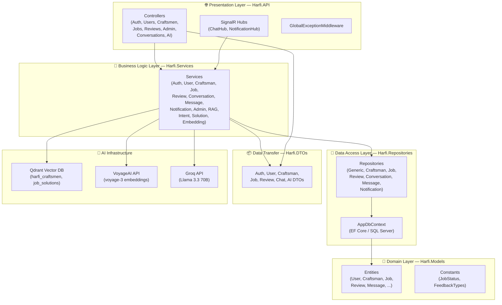
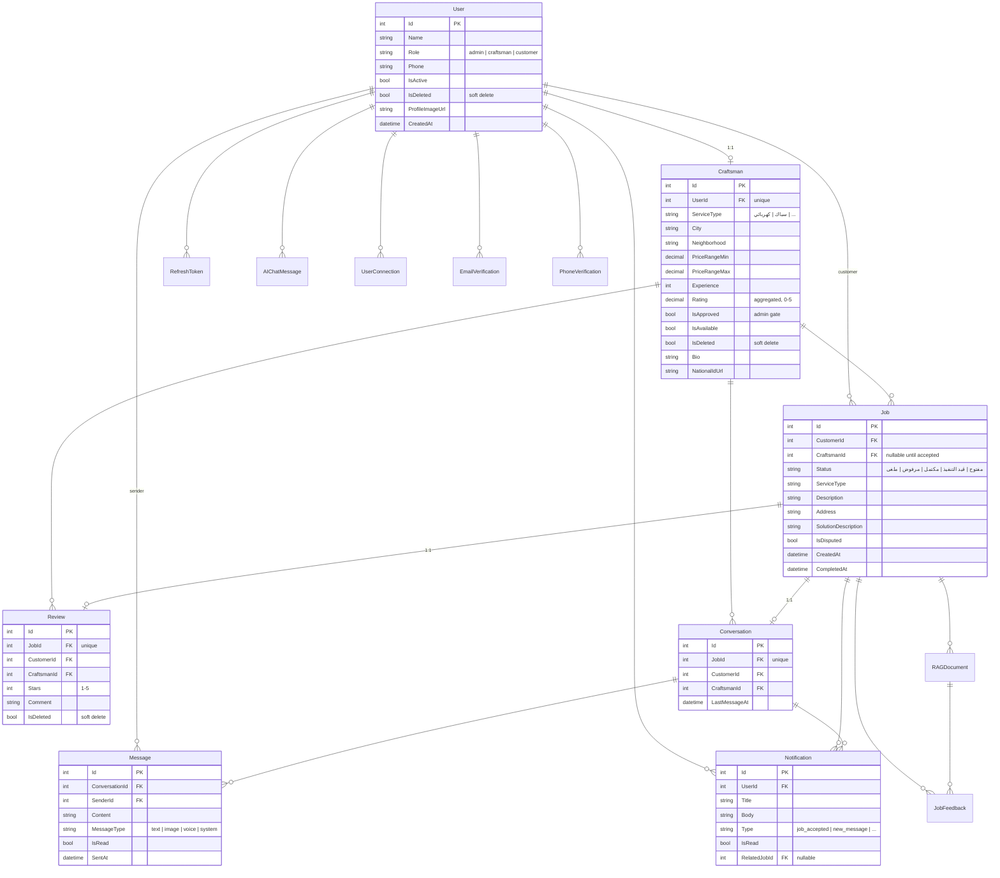
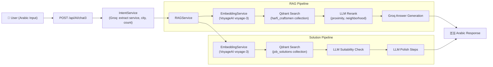
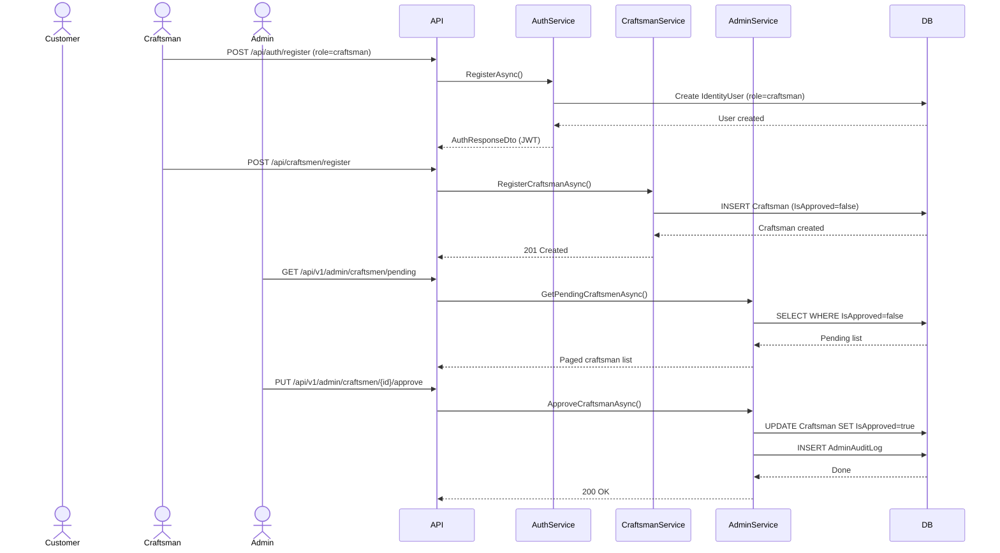
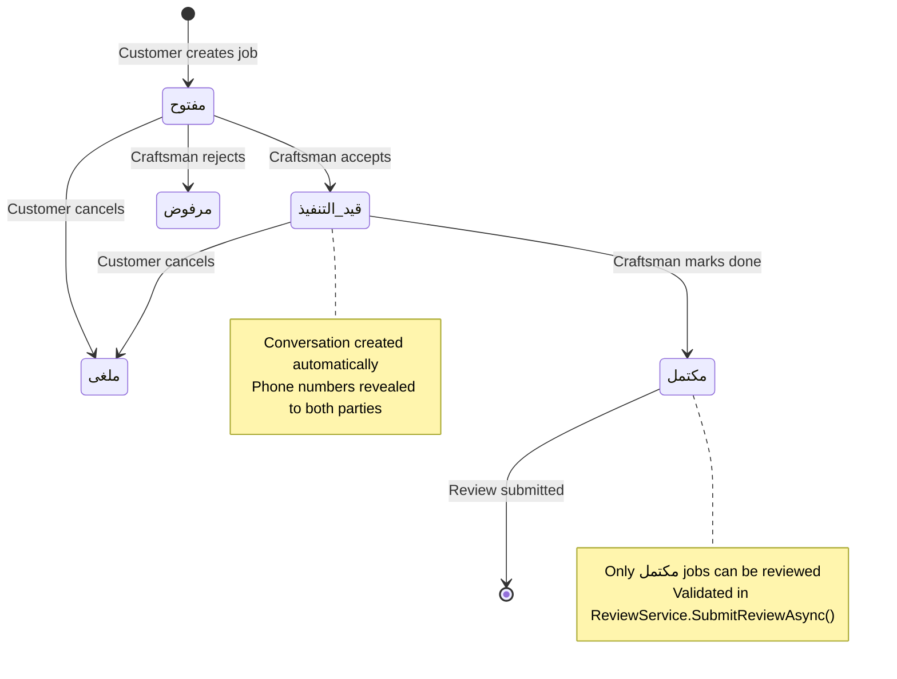
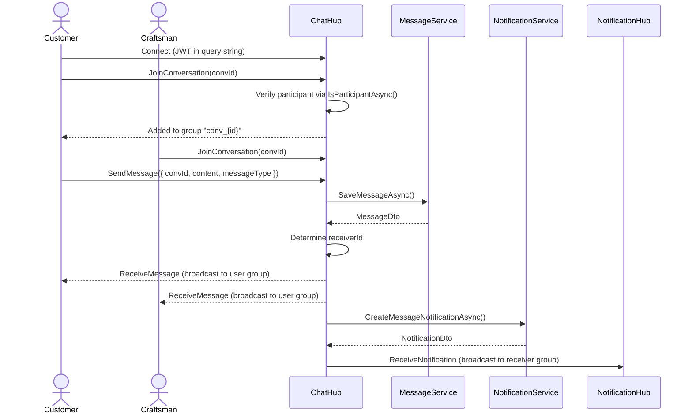

<p align="center">
  
  
  
  
  
  
  
  
  
  
  <a href="https://harfi.runasp.net/index.html"></a>
  <a href="https://harfii.runasp.net/"></a>
</p>

<h1 align="center">🔨 Harfi API — حرفي</h1>

<p align="center">
  <em>Arabic-first platform connecting Egyptian customers with verified craftsmen. Built with .NET 8, powered by AI.</em>
  <br/>
  <strong>ربط العملاء المصريين بالحرفيين الموثوقين — بذكاء اصطناعي</strong>
</p>

---

## 📖 Table of Contents

- [Live Demo](#live-demo)
- [Overview](#overview)
- [Key Features](#key-features)
- [System Architecture](#system-architecture)
- [Database Schema](#database-schema)
- [AI & Agentic Layer](#ai--agentic-layer)
- [Core Workflows](#core-workflows)
- [API Reference](#api-reference)
- [Tech Stack](#tech-stack)
- [Project Structure](#project-structure)
- [Getting Started](#getting-started)
- [Deployment](#deployment)
- [Team](#team)
- [License](#license)

---

## 🎮 Live Demo

The project is publicly deployed and accessible:

| Service | URL | Description |
|---------|-----|-------------|
| **Backend API** (Swagger UI) | [https://harfi.runasp.net/index.html](https://harfi.runasp.net/index.html) | Browse and test all API endpoints interactively with JWT auth support |
| **Frontend App** | [https://harfii.runasp.net/](https://harfii.runasp.net/) | End-user Angular application for customers and craftsmen |

> The hosted Swagger UI includes the "Authorize" button — paste a JWT token obtained from `POST /api/auth/login` or `POST /api/auth/register` to authenticate against secured endpoints.

---

## 📋 Overview

**Harfi (حرفي)** is a full-featured backend platform designed to bridge the gap between Egyptian homeowners and skilled craftsmen. It provides a trusted marketplace where customers can find, book, review, and communicate with verified professionals — from plumbers and electricians to carpenters and painters.

The platform follows a **Clean N-Tier Architecture** with ASP.NET Core 8, Identity + JWT for role-based authentication, Entity Framework Core + SQL Server for persistence, and **SignalR** for real-time chat and notifications. What sets Harfi apart is its **AI-powered assistant** — an intelligent chat agent that uses Retrieval-Augmented Generation (RAG) to understand user problems in Arabic, offer DIY fix-it steps, and recommend the best craftsmen by performing semantic search against a **Qdrant** vector database with **VoyageAI** embeddings and **Groq (Llama 3.3)** inference.

This graduation project (ITI) was delivered in phases: auth & identity → profiles & admin controls → booking state machine → reviews & closures → real-time communications → AI orchestration agent.

---

## ✨ Key Features

- **🔐 JWT Authentication with Email & Phone Verification** — Full registration/login flow with email OTP verification (MailKit + Gmail SMTP) and phone number confirmation via 6-digit codes. Refresh token rotation for secure sessions.
- **👤 Role-Based Access Control** — Three distinct roles (`admin`, `craftsman`, `customer`) with `[Authorize]` enforcement per endpoint.
- **🔧 Craftsman Profiles & Admin Approval** — Craftsmen submit applications with National ID upload; admins review, approve, reject, or suspend. Full audit logging of every admin action.
- **📋 Job Booking State Machine** — Customers create jobs → craftsmen accept/reject → work in progress → completion with solution description. Arabic status flow: `مفتوح → قيد التنفيذ → مكتمل → مرفوض → ملغى`.
- **⭐ Reviews & Ratings** — One review per completed job (1–5 stars + comment). Aggregated ratings displayed on craftsman profiles. Enforced server-side: only `مكتمل` jobs qualify.
- **💬 Real-Time Chat** — SignalR-powered conversations between customer and craftsman per job. Typing indicators, read receipts, message persistence, voice/image messages.
- **🔔 Push-Style Notifications** — Persisted notifications for job events (accepted, rejected, completed) and new messages, delivered via SignalR and stored for offline retrieval.
- **🤖 AI Assistant (RAG-Powered)** — Arabic conversational agent built on Groq (Llama 3.3 70B) + VoyageAI embeddings (1024-dim) + Qdrant vector DB. Detects user intent (find craftsman / get DIY steps), extracts service type and city via LLM, semantically searches craftsmen or job-solution history, and reranks results.
- **🔍 Semantic Search via Qdrant** — Craftsman profiles and completed job solutions are chunked, embedded, and indexed in Qdrant collections (`harfi_craftsmen`, `job_solutions`) for cosine-similarity retrieval. Expands to nearby governorates when local results are insufficient.
- **📧 Email & Phone Verification** — HTML email templates with 6-digit codes via Gmail SMTP. Rate-limited with code expiry (10 minutes). Phone verification via console (dev) / Twilio (production stub).
- **🛡️ Rate Limiting** — IP-based rate limiting (AspNetCoreRateLimit) on auth endpoints: 10 login attempts/5min, 5 registrations/hour, 3 resend-code/10min.
- **🗄️ Comprehensive SQL Schema** — 20+ tables covering users, craftsmen, jobs, conversations, messages, reviews, notifications, refresh tokens, AI interactions, RAG documents, media files, feedback, user connections, email/phone verifications, admin audit logs, reports, service types, cities, and feature flags.

---

## 🏗️ System Architecture

### Layered Architecture



### Design Patterns

| Pattern | Location | Purpose |
|---------|----------|---------|
| **Repository** | `Harfi.Repositories/Implementations/*.cs` | Abstracts EF Core `DbSet` queries behind interfaces for testability |
| **Generic Repository** | `GenericRepository.cs` | Base CRUD operations for all entities (GetById, Find, Add, Remove) |
| **DTO / Data Transfer Object** | `Harfi.DTOs/*` | Prevents entity exposure across layers; decouples API schema from persistence |
| **Dependency Injection** | `ServiceExtensions.cs`, `RagServiceExtensions.cs` | All services, repositories, and HTTP clients registered via `IServiceCollection` |
| **Result Pattern** | `ServiceResult.cs` | Encapsulates success/failure + typed data from services to controllers |
| **Singleton HTTP Client Rotation** | `GroqRotatingClient.cs` | Thread-safe API key rotation across multiple Groq keys on 429/401 responses |
| **Middleware Pipeline** | `GlobalExceptionMiddleware.cs` | Catches all unhandled exceptions → structured JSON error response |
| **Global Query Filters** | `AppDbContext.OnModelCreating` | Soft-delete filter (`IsDeleted == false`) on User, Craftsman, Review entities |
| **Strategy (Environment)** | `ConsoleSmsService` / `TwilioSmsService` | Console SMS in dev, Twilio SMS in production — swapped via `IWebHostEnvironment` check |

### Cross-Cutting Concerns

- **Exception Handling**: `GlobalExceptionMiddleware` (`Middleware/GlobalExceptionMiddleware.cs`) — maps exception types to HTTP status codes + Arabic error messages, logs all errors
- **Rate Limiting**: AspNetCoreRateLimit middleware with IP-based throttling on auth endpoints (login: 10/5min, register: 5/1h, verify/resend: 10/10min, 3/10min)
- **Validation**: Server-side validation in service methods (not FluentValidation or DataAnnotations on DTOs — manual guard clauses with Arabic error messages)
- **Logging**: Built-in `ILogger<T>` throughout services, middleware, and hubs

---

## 🗄️ Database Schema

The schema consists of **20+ tables** with Identity (ASP.NET Core Identity) integration. Key relationships:



### Key Schema Rules

- **User ↔ Craftsman**: 1:1 — a user can have at most one craftsman profile. Enforced via unique FK constraint in `AppDbContext.OnModelCreating`.
- **Job ↔ Review**: 1:1 — at most one review per job. Enforced by unique `JobId` index in `Review` table.
- **Job ↔ Conversation**: 1:1 — each job has exactly one conversation thread.
- **Soft Delete**: `User`, `Craftsman`, `Review`, `Conversation`, and `Message` support soft delete via `IsDeleted` flag with global query filters.
- **Craftsman Rating**: Computed column (`Rating`) aggregated from associated `Review.Stars` values, updated via `CraftsmanChangeInterceptor` on EF Core `SaveChanges`.

### Configuration Entities

The database also stores dynamic configuration in tables:
- **ServiceTypes** — Arabic/English service names (e.g., سباك/Plumber) + icon URLs
- **Cities** — Arabic/English city names with governorate metadata
- **FeatureFlags** — Key-value feature toggles (string PK, e.g., `"enable_ai_agent"`)

---

## 🤖 AI & Agentic Layer

The AI subsystem is the key differentiator of Harfi. It enables a multi-turn Arabic conversational agent that understands user problems, offers DIY guidance, and recommends craftsmen.

### Architecture



### Components

| Component | File | Technology | Purpose |
|-----------|------|-----------|---------|
| **LLM Client** | `GroqRotatingClient.cs` | Groq API (OpenAI-compatible) | Thread-safe multi-key rotation on 429/401 |
| **LLM Model** | `Groq:ChatModel` → `llama-3.3-70b-versatile` | Groq hosted | Intent extraction, reranking, answer generation |
| **Embeddings** | `EmbeddingService.cs` | VoyageAI `voyage-3` (1024 dim) | Converts text → vector for Qdrant search |
| **Vector DB** | `VectorDbService.cs` | Qdrant HTTP API | Stores `harfi_craftsmen` and `job_solutions` collections (Cosine distance, 1024 dim) |
| **Chunking** | `ChunkingService.cs` | Custom | Each craftsman → 1 chunk with metadata (service_type, city, governorate, rating) |
| **Intent Extraction** | `IntentService.cs` | Groq LLM | Extracts `service_type`, `city`, `count`, `district` from multi-turn Arabic conversation |
| **RAG Orchestrator** | `RAGService.cs` | Custom pipeline | Intent → keyword fallback → embedding → Qdrant search → city/nearby expansion → LLM rerank → answer |
| **Solution Finder** | `SolutionService.cs` | Custom pipeline | Embeds problem → searches `job_solutions` → LLM suitability check → polish or generate steps |
| **AI Session Persistence** | `AIChatMessage` entity | SQL Server | Stores multi-turn chat history with `SessionId` grouping, token usage tracking |

### RAG Pipeline Flow

1. **Intent Detection**: User Arabic query → `IntentService` calls Groq to extract `service_type`, `city`, `count`. Falls back to keyword matching if LLM fails.
2. **Embedding**: Query embedded via VoyageAI `voyage-3` with `input_type = "query"` (1024-dim vector).
3. **Vector Search**: Qdrant `harfi_craftsmen` collection searched with Cosine similarity. Fetch multiplier: 10× top-K for reranking buffer.
4. **Filter & Expand**: Results filtered by service type; city filter applied; expands to nearby governorates via static `NearbyMap` if local results are insufficient.
5. **Score Fusion**: Final score = 70% vector similarity + 30% craftsman rating.
6. **LLM Rerank**: Groq reranks top candidates by geographic proximity and neighborhood.
7. **Answer Generation**: Groq generates a natural Arabic answer with craftsman recommendations.
8. **SQL Fallback**: If Qdrant/embeddings fail, falls back to pure SQL `LIKE` query on service type.

### Solution Pipeline Flow

1. Problem description embedded via VoyageAI.
2. Qdrant `job_solutions` collection searched (top-K=5, minScore=0.0).
3. Each candidate checked by LLM for suitability against user's problem.
4. Suitable matches: LLM polishes existing steps. No match: LLM generates steps from scratch.
5. Boosted scoring: 60% vector similarity + 25% review stars + 10% craftsman rating + 5% recency.

### Conversation History

The AI agent persists multi-turn conversations in the `AIChatMessages` table (entity: `AIChatMessage`, file: `AIInteraction.cs`), grouped by `SessionId` (GUID). The `POST /api/AI/chat3` endpoint accepts a list of prior messages for context, enabling coherent follow-ups.

---

## 🔄 Core Workflows

### 1. Craftsman Registration & Admin Approval



### 2. Job Booking Lifecycle



### 3. Real-Time Chat Flow



### Key Server-Side Rules

| Rule | Enforced In | Why Server-Side |
|------|-----------|-----------------|
| Only `مكتمل` (completed) jobs can be reviewed | `ReviewService.SubmitReviewAsync()` | Prevents fake reviews on open/in-progress jobs |
| At most one review per job | `AppDbContext.OnModelCreating` (unique index on `Review.JobId`) | Prevents review spam |
| Craftsmen must be `IsApproved=true` to appear in search | `CraftsmanRepository.GetFilteredCraftsmenAsync()` | Admin review gate before public visibility |
| Only the owning user or admin can update a profile | `UsersController.profile/{id}` — manual role check | Prevents unauthorized profile edits |
| Refresh token rotation (old token revoked on refresh) | `AuthService.RefreshTokenAsync()` | Mitigates stolen token replay |
| Email code expiry (10 minutes) | `EmailService` / `AuthService.VerifyEmailAsync()` | Limits brute-force window |
| Phone numbers only visible to conversation participants | `ConversationService.IsParticipantAsync()` used in hubs | Prevents phone number scraping |

---

## 📡 API Reference

### Auth Endpoints

| Method | Route | Auth | Role | Description |
|--------|-------|------|------|-------------|
| `POST` | `/api/auth/register` | Anonymous | Guest | Register customer or craftsman → JWT + refresh token |
| `POST` | `/api/auth/login` | Anonymous | Guest | Login → JWT + refresh token |
| `POST` | `/api/auth/refresh` | Anonymous | Guest | Rotate refresh token |
| `POST` | `/api/auth/logout` | Authenticated | Any | Revoke refresh token + disconnect SignalR |
| `GET` | `/api/auth/me` | Authenticated | Any | Get current user profile from JWT |
| `POST` | `/api/auth/verify-email` | Anonymous | Guest | Verify email with 6-digit code |
| `POST` | `/api/auth/resend-code` | Anonymous | Guest | Resend email OTP |
| `POST` | `/api/auth/forgot-password` | Anonymous | Guest | Send password reset code |
| `POST` | `/api/auth/reset-password` | Anonymous | Guest | Reset password with code |
| `POST` | `/api/auth/send-phone-code` | Authenticated | Any | Send phone OTP |
| `POST` | `/api/auth/verify-phone` | Authenticated | Any | Verify phone with 6-digit code |
| `POST` | `/api/auth/resend-phone-code` | Authenticated | Any | Resend phone OTP |

### User Endpoints

| Method | Route | Auth | Role | Description |
|--------|-------|------|------|-------------|
| `GET` | `/api/Users/profile/{id}` | Authenticated | Any | Get user profile |
| `PUT` | `/api/Users/profile/{id}` | Authenticated | Owner/Admin | Update user profile |
| `POST` | `/api/Users/profile/{id}/upload-image` | Authenticated | Owner/Admin | Upload profile image (jpeg/png/webp, max 5MB) |

### Craftsman Endpoints

| Method | Route | Auth | Role | Description |
|--------|-------|------|------|-------------|
| `POST` | `/api/Craftsmen/register` | Anonymous | Guest | Submit craftsman application (sets `IsApproved=false`) |
| `GET` | `/api/Craftsmen/{id}` | Anonymous | Public | Get craftsman public profile |
| `GET` | `/api/Craftsmen/search` | Anonymous | Public | Search/filter craftsmen by service, city, rating, experience |
| `PUT` | `/api/Craftsmen/{id}` | Authenticated | Craftsman | Update own craftsman profile |
| `POST` | `/api/Craftsmen/{id}/upload-national-id` | Authenticated | Craftsman | Upload National ID image |
| `GET` | `/api/Craftsmen/active-services` | Anonymous | Public | List distinct active service types |
| `GET` | `/api/Craftsmen/active-cities` | Anonymous | Public | List distinct active cities |

### Job Endpoints

| Method | Route | Auth | Role | Description |
|--------|-------|------|------|-------------|
| `POST` | `/api/jobs` | Authenticated | Customer | Create a new job |
| `POST` | `/api/jobs/upload-image` | Authenticated | Customer | Upload job problem image (jpeg/png/webp, max 5MB) |
| `PUT` | `/api/jobs/{id}/accept` | Authenticated | Craftsman | Accept job → status `قيد التنفيذ`, creates conversation |
| `PUT` | `/api/jobs/{id}/reject` | Authenticated | Craftsman | Reject job → status `مرفوض` |
| `PUT` | `/api/jobs/{id}/complete` | Authenticated | Craftsman | Complete job → status `مكتمل`, add solution description |
| `GET` | `/api/jobs/customer/{id}` | Authenticated | Any | List customer's jobs |
| `GET` | `/api/jobs/{id}` | Authenticated | Any | Get job details |
| `GET` | `/api/jobs/craftsman/{id}` | Authenticated | Any | List craftsman's jobs |

### Review Endpoints

| Method | Route | Auth | Role | Description |
|--------|-------|------|------|-------------|
| `POST` | `/api/reviews` | Authenticated | Customer | Submit review (1–5 stars + comment) for completed job |
| `GET` | `/api/reviews/craftsman/{craftsmanId}` | Anonymous | Public | Get craftsman reviews with aggregated average |
| `POST` | `/api/reviews/rag-feedback` | Authenticated | Any | Submit feedback on AI guide (helpful/not) |

### Conversation Endpoints

| Method | Route | Auth | Role | Description |
|--------|-------|------|------|-------------|
| `POST` | `/api/Conversations` | Authenticated | Any | Create or get existing conversation for a job |
| `GET` | `/api/Conversations` | Authenticated | Any | List user's conversations |
| `GET` | `/api/Conversations/{id}` | Authenticated | Any | Get conversation details |
| `GET` | `/api/Conversations/{id}/messages` | Authenticated | Any | Get paginated messages (max 100 per page) |
| `PUT` | `/api/Conversations/{id}/read` | Authenticated | Any | Mark conversation as read |
| `DELETE` | `/api/Conversations/{id}` | Authenticated | Owner | Soft-delete conversation (per-user hide) |
| `DELETE` | `/api/Conversations/{id}/messages/{messageId}` | Authenticated | Sender | Delete own message |
| `POST` | `/api/Conversations/upload-image` | Authenticated | Any | Upload chat image |
| `POST` | `/api/Conversations/upload-voice` | Authenticated | Any | Upload voice message (.mp3/.wav/.ogg/.webm, max 10MB) |

### Notification Endpoints

| Method | Route | Auth | Role | Description |
|--------|-------|------|------|-------------|
| `GET` | `/api/Notifications` | Authenticated | Any | List user's notifications |
| `GET` | `/api/Notifications/unread-count` | Authenticated | Any | Get unread notification count |
| `PUT` | `/api/Notifications/{id}/read` | Authenticated | Any | Mark single notification as read |
| `PUT` | `/api/Notifications/read-all` | Authenticated | Any | Mark all notifications as read |
| `DELETE` | `/api/Notifications/{id:int}` | Authenticated | Owner | Delete single notification |
| `DELETE` | `/api/Notifications/clear` | Authenticated | Any | Clear all notifications |

### Admin Endpoints

<details>
<summary>🔐 Admin Endpoints — click to expand (39 endpoints)</summary>

#### Craftsman Management
| Method | Route | Description |
|--------|-------|-------------|
| `GET` | `/api/v1/admin/craftsmen/pending` | List pending craftsman applications (paginated, filterable) |
| `GET` | `/api/v1/admin/craftsmen/approved` | List approved craftsmen |
| `GET` | `/api/v1/admin/craftsmen/rejected` | List rejected craftsmen |
| `GET` | `/api/v1/admin/craftsmen/{id}` | Get craftsman full details |
| `PUT` | `/api/v1/admin/craftsmen/{id}/approve` | Approve craftsman (with optional note) |
| `PUT` | `/api/v1/admin/craftsmen/{id}/reject` | Reject craftsman (with reason required) |
| `PUT` | `/api/v1/admin/craftsmen/{id}/suspend` | Suspend craftsman (with reason) |
| `DELETE` | `/api/v1/admin/craftsmen/{id}` | Delete craftsman (soft, with reason) |

#### User Management
| Method | Route | Description |
|--------|-------|-------------|
| `GET` | `/api/v1/admin/users` | List users (paginated, filterable by role/status) |
| `GET` | `/api/v1/admin/users/{id}` | Get user details |
| `GET` | `/api/v1/admin/users/{id}/activity` | Get user activity log |
| `PUT` | `/api/v1/admin/users/{id}/deactivate` | Deactivate user (with reason) |
| `PUT` | `/api/v1/admin/users/{id}/reactivate` | Reactivate user |
| `DELETE` | `/api/v1/admin/users/{id}` | Delete user (soft, with reason) |

#### Job & Dispute Management
| Method | Route | Description |
|--------|-------|-------------|
| `GET` | `/api/v1/admin/jobs` | List all jobs (filterable by status, date, user) |
| `GET` | `/api/v1/admin/jobs/{id}` | Get job details |
| `PUT` | `/api/v1/admin/jobs/{id}/status` | Manually update job status |
| `PUT` | `/api/v1/admin/jobs/{id}/flag-dispute` | Flag job as disputed |
| `PUT` | `/api/v1/admin/jobs/{id}/resolve-dispute` | Resolve dispute with notes |
| `GET` | `/api/v1/admin/jobs/{id}/chat-metadata` | Get job chat metadata |
| `GET` | `/api/v1/admin/jobs/{id}/chat-messages` | View job chat messages (admin override) |

#### Content Moderation
| Method | Route | Description |
|--------|-------|-------------|
| `GET` | `/api/v1/admin/reviews` | List all reviews (filterable) |
| `GET` | `/api/v1/admin/reviews/{id}` | Get review details |
| `DELETE` | `/api/v1/admin/reviews/{id}` | Delete review (soft, with reason) |
| `GET` | `/api/v1/admin/reports` | List user reports |
| `PUT` | `/api/v1/admin/reports/{id}/resolve` | Resolve a report |
| `GET` | `/api/v1/admin/ai-logs` | View AI interaction logs |

#### Analytics
| Method | Route | Description |
|--------|-------|-------------|
| `GET` | `/api/v1/admin/analytics/overview` | Platform-wide stats (users, jobs, reviews counts) |
| `GET` | `/api/v1/admin/analytics/craftsmen` | Craftsman-specific analytics |
| `GET` | `/api/v1/admin/analytics/jobs` | Job-specific analytics |
| `GET` | `/api/v1/admin/analytics/ai` | AI usage analytics |
| `GET` | `/api/v1/admin/analytics/reviews` | Review-specific analytics |
| `GET` | `/api/v1/admin/analytics/export` | Download analytics as CSV |

#### Platform Configuration
| Method | Route | Description |
|--------|-------|-------------|
| `GET` | `/api/v1/admin/config/service-types` | List configured service types |
| `GET` | `/api/v1/admin/config/cities` | List configured cities |
| `GET` | `/api/v1/admin/config/feature-flags` | List feature flags |
| `PUT` | `/api/v1/admin/config/feature-flags/{key}` | Toggle feature flag |

#### Audit Logs
| Method | Route | Description |
|--------|-------|-------------|
| `GET` | `/api/v1/admin/audit-logs` | List admin audit logs |
| `GET` | `/api/v1/admin/audit-logs/{id}` | Get audit log details |

</details>

### AI Endpoints

| Method | Route | Auth | Description |
|--------|-------|------|-------------|
| `GET` | `/api/AI/welcome` | Public | Get welcome message with introductory text |
| `POST` | `/api/AI/chat3` | Public | Multi-turn Arabic AI conversation — intent extraction → RAG search → answer generation |
| `POST` | `/api/AI/ingest/craftsmen` | Admin | Batch-ingest all (or from ID) craftsmen into Qdrant |
| `POST` | `/api/AI/ingest/jobs` | Admin | Batch-ingest completed job solutions into Qdrant |
| `POST` | `/api/AI/ingest/job/{jobId}` | Public | Ingest a single job solution into Qdrant |
| `GET` | `/api/AI/vectors/count` | Admin | Get total vector count in Qdrant |
| `POST` | `/api/AI/analyze-media` | Public | Upload problem image/audio → analyze via n8n webhook → return solution steps |
| `GET` | `/api/AI/sessions/{userId}` | Public | List AI chat sessions for a user |
| `GET` | `/api/AI/sessions/{userId}/{sessionId}` | Public | Get full AI chat session history |
| `POST` | `/api/AI/sessions/message` | Public | Save an AI chat message with optional images/audio |
| `DELETE` | `/api/AI/sessions/{userId}/{sessionId}` | Public | Delete an AI chat session |
| `POST` | `/api/AI/craftsman/check-and-submit-solution` | Public | Submit craftsman solution via AI flow |
| `POST` | `/api/AI/qdrant-indexes` | Public | Ensure Qdrant indexes exist |

### SignalR Hubs

| Hub | Path | Auth | Connection |
|-----|------|------|-----------|
| `ChatHub` | `/hubs/chat` | JWT (query string `?access_token=`) | Tracked in `UserConnections` table; user groups (`user_{userId}`, `conv_{convId}`) |
| `NotificationHub` | `/hubs/notifications` | JWT (query string `?access_token=`) | User groups (`user_{userId}`) for targeted notification delivery |

#### ChatHub Methods (client → server)

| Method | Parameters | Description |
|--------|-----------|-------------|
| `JoinConversation` | `int conversationId` | Join the SignalR group for a conversation |
| `LeaveConversation` | `int conversationId` | Leave the conversation group |
| `SendMessage` | `SendMessageDto` | Send text/image/voice/location message — validates content (max 2000 chars), participant check, persistence, broadcasts `ReceiveMessage` and `ReceiveNotification` |
| `DeleteMessage` | `int conversationId, int messageId` | Delete own message — broadcasts `MessageDeleted` |
| `Typing` | `int conversationId` | Broadcast `UserTyping` to the other participant |
| `MarkAsRead` | `int conversationId` | Mark conversation read — broadcasts `MessagesRead` |
| `SetOffline` | — | Manually set user offline, remove connection |

#### ChatHub Events (server → client)

| Event | Payload | When |
|-------|---------|------|
| `ReceiveMessage` | `MessageDto` | New message sent in a conversation |
| `MessageDeleted` | `conversationId, messageId` | A message was deleted |
| `UserTyping` | `conversationId, userId` | Participant is typing |
| `MessagesRead` | `conversationId, userId` | Participant marked messages as read |
| `ConversationUpdated` | `ConversationDto` | Conversation metadata changed |
| `UserOnline` | `userId` | User connected |
| `UserOffline` | `userId` | User disconnected |

#### NotificationHub Events (server → client)

| Event | Payload | When |
|-------|---------|------|
| `ReceiveNotification` | `NotificationDto` | New notification (job event, new message) |

---

## 🛠️ Tech Stack

| Layer | Technology | Version | Purpose |
|-------|-----------|---------|---------|
| **Runtime** | .NET | 8.0 | Application runtime |
| **Language** | C# | 12 | Primary development language |
| **Web Framework** | ASP.NET Core | 8.0 | REST API framework |
| **ORM** | Entity Framework Core | 8.0.15 | Database ORM |
| **Database** | SQL Server | — | Primary data store |
| **Auth** | ASP.NET Core Identity | 8.0.11 | User store, password hashing, token providers |
| **Auth (Bearer)** | JWT Bearer Authentication | 8.0.11 | Token-based API authentication |
| **API Docs** | Swashbuckle / Swagger | 6.5.0 | OpenAPI 3.0 documentation |
| **Real-Time** | SignalR | (built-in) | WebSocket chat + notifications |
| **Email** | MailKit | 4.16.0 | SMTP email sending (Gmail) |
| **Rate Limiting** | AspNetCoreRateLimit | 4.0.2 | IP-based rate limiting |
| **Vector DB** | Qdrant | HTTP API | Semantic search for craftsmen + solutions |
| **LLM Provider** | Groq (Llama 3.3-70B) | HTTP API | Arabic intent extraction, reranking, answer generation |
| **Embeddings** | VoyageAI (voyage-3) | HTTP API | 1024-dim Arabic text embeddings |
| **HTTP Clients** | `IHttpClientFactory` | 8.0.0 | Typed HTTP clients for AI APIs |
| **Identity Tokens** | `System.IdentityModel.Tokens.Jwt` | 8.18.0 | JWT generation + validation |
| **File Storage** | Local filesystem (`wwwroot/`) | — | Profile images, job images, chat media |

---

## 🏗️ Project Structure

```
Harfi/                              # Solution root (Harfi.slnx)
├── Harfi.API/                      # 🚀 Entry point — Controllers, Middleware, Hubs, DI
│   ├── Controllers/                # HTTP endpoints (one per feature)
│   │   ├── AuthController.cs       #     Register, login, refresh, email/phone verify
│   │   ├── UsersController.cs      #     User profile CRUD + image upload
│   │   ├── CraftsmenController.cs  #     Craftsman registration, search, profiles
│   │   ├── AdminController.cs      #     Admin: approve/reject/suspend, analytics, audit
│   │   ├── JobsController.cs       #     Job lifecycle (create, accept, complete, reject)
│   │   ├── ReviewsController.cs    #     Submit reviews + AI feedback
│   │   ├── ConversationsController.cs  # Chat conversations CRUD + media upload
│   │   ├── NotificationsController.cs  # User notification management
│   │   └── AIController.cs         #     🤖 AI chat, ingestion, session management
│   ├── Hubs/                       # SignalR real-time hubs
│   │   ├── ChatHub.cs              #     Real-time messaging, typing, read receipts
│   │   ├── NotificationHub.cs      #     Real-time notification delivery
│   │   └── SignalRNotificationPusher.cs  # Service → Hub bridge
│   ├── Middleware/
│   │   └── GlobalExceptionMiddleware.cs  # Unified error handling → JSON
│   ├── Extensions/
│   │   ├── ServiceExtensions.cs    #     DI registration (DB, auth, Swagger, CORS, rate limit)
│   │   └── RagServiceExtensions.cs #     AI HTTP clients + RAG pipeline DI
│   ├── Program.cs                  # App bootstrap & middleware pipeline
│   ├── appsettings.json            # Configuration (secrets via User Secrets)
│   └── Properties/
│       └── launchSettings.json     # Dev profiles (http:5108, https:5001)
│
├── Harfi.Services/                 # 📐 Business Logic Layer
│   ├── Interfaces/                 # 17 service contracts
│   └── Implementations/           # 25 concrete implementations
│       ├── AuthService.cs          #     Identity + JWT token management
│       ├── CraftsmanService.cs     #     Registration, profiles, search
│       ├── JobService.cs           #     Job state machine + notifications
│       ├── ReviewService.cs        #     Submit + aggregate reviews
│       ├── ConversationService.cs  #     Conversation CRUD + participant check
│       ├── MessageService.cs       #     Message persistence + pagination
│       ├── NotificationService.cs  #     Create, mark read, count, SignalR push
│       ├── AdminService.cs         #     Pending list, approve, reject, analytics
│       ├── RAGService.cs           #     🤖 RAG query: ingest, search, LLM rerank
│       ├── IntentService.cs        #     LLM-based intent extraction (service, city, count)
│       ├── SolutionService.cs      #     DIY solution steps from vector DB + LLM
│       ├── ChunkingService.cs      #     Craftsman → text chunk for embedding
│       ├── EmbeddingService.cs     #     VoyageAI API wrapper
│       ├── VectorDbService.cs      #     Qdrant HTTP client (upsert, search, count)
│       ├── GroqRotatingClient.cs   #     Multi-API-key Groq client with rotation
│       └── Imageservice.cs         #     Local filesystem image upload
│
├── Harfi.Repositories/            # 💾 Data Access Layer
│   ├── Data/
│   │   ├── AppDbContext.cs         #     EF Core DbContext — 22 DbSets + Fluent API
│   │   ├── AppDbContextFactory.cs  #     Design-time factory for migrations
│   │   └── DataSeeder.cs           #     Seeds 46 craftsmen, 25 customers, 15+ tables
│   ├── Interfaces/                 # 9 repository contracts
│   ├── Implementations/           # 9 concrete repositories
│   └── Migrations/                 # ⚠️ Auto-generated EF Core migrations
│
├── Harfi.Models/                   # 🧱 Entity Models Layer
│   ├── Entities/                   # 18 entity classes (User, Craftsman, Job, ...)
│   └── Constants/                  # JobStatusConstants (Arabic), FeedbackTypes
│
├── Harfi.DTOs/                     # 📦 Data Transfer Objects
│   ├── Auth/                       # RegisterDto, LoginDto, AuthResponseDto, etc.
│   ├── Craftsman/                  # CraftsmanDto, CreateCraftsmanDto, CraftsmanFilterDto
│   ├── Job/                        # CreateJobDto, JobResponseDto, UpdateJobStatusDto
│   ├── Review/                     # CreateReviewDto, ReviewResponseDto
│   ├── Chat/                       # MessageDto, ConversationDto, SendMessageDto
│   ├── AI/                         # Chat3Request/Response, Qdrant DTOs
│   └── Admin/                      # Admin request/response DTOs
│
├── docs/                           # 📚 Project documentation
├── .github/workflows/              # 📦 GitHub Actions (to be configured)
│
├── .gitignore                      # Visual Studio + .NET standard ignores
├── LICENSE                         # MIT license
└── Harfi.slnx                     # Solution file (VS 2022)
```

### Dependency Flow

```
        ┌─────────────────────────────────────────────────────┐
        │  API  ───→  Services  ───→  Repositories  ───→  Models  │
        │   ↘                                        ↗            │
        │         DTOs ──────────────────────────────             │
        └─────────────────────────────────────────────────────┘
```

---

## 🚀 Getting Started

### Prerequisites

| Requirement | Version | Notes |
|------------|---------|-------|
| [.NET SDK](https://dotnet.microsoft.com/download/dotnet/8) | **8.0.x** | Includes runtime, ASP.NET Core, EF Core tools |
| [SQL Server](https://www.microsoft.com/sql-server) | 2019+ / LocalDB | Or use Docker image |
| [Qdrant](https://qdrant.tech/documentation/quick-start/) | Latest | Vector database for AI features |
| [Visual Studio 2022](https://visualstudio.microsoft.com/) | 17.8+ | Or VS Code + C# Dev Kit |
| [Git](https://git-scm.com/) | Latest | — |
| [dotnet-ef](https://learn.microsoft.com/ef/core/cli/dotnet) | Latest | `dotnet tool install --global dotnet-ef` |

### Environment Variables

All sensitive values are managed via **.NET User Secrets** (Development) or environment variables (Production).

| Key | Description | Required | Default |
|-----|-------------|----------|---------|
| `ConnectionStrings:DefaultConnection` | SQL Server connection string | ✅ | — |
| `JwtSettings:SecretKey` | HMAC-SHA256 signing key (≥32 chars) | ✅ | — |
| `JwtSettings:Issuer` | JWT issuer | ❌ | `HarfiAPI` |
| `JwtSettings:Audience` | JWT audience | ❌ | `HarfiClient` |
| `JwtSettings:AccessTokenExpiryMinutes` | Access token lifetime (minutes) | ❌ | `60` |
| `JwtSettings:RefreshTokenExpiryDays` | Refresh token lifetime (days) | ❌ | `30` |
| `EmailSettings:Host` | SMTP host | ❌ | `smtp.gmail.com` |
| `EmailSettings:Port` | SMTP port | ❌ | `587` |
| `EmailSettings:SenderEmail` | Gmail address for sending | ✅ | — |
| `EmailSettings:SenderName` | Display sender name | ❌ | `Harfi Platform` |
| `EmailSettings:AppPassword` | Gmail app password | ✅ | — |
| `Voyage:ApiKey` | VoyageAI embedding API key | ❌* | — |
| `Voyage:EmbeddingModel` | Embedding model name | ❌ | `voyage-3` |
| `Groq:ApiKey` | Groq LLM API key (single fallback) | ❌* | — |
| `Groq:ApiKeys` | Array of Groq API keys (rotation) | ❌* | — |
| `Groq:ChatModel` | LLM model name | ❌ | `llama-3.3-70b-versatile` |
| `Qdrant:BaseUrl` | Qdrant server URL | ❌ | `http://localhost:6400/` |
| `Qdrant:ApiKey` | Qdrant cloud API key | ❌ | — |
| `AllowedOrigins` | CORS allowed origins (array) | ❌ | `["http://localhost:4200"]` |
| `Cloudinary:CloudName` | Cloudinary cloud name | ❌* | — |
| `Cloudinary:ApiKey` | Cloudinary API key | ❌* | — |
| `Cloudinary:ApiSecret` | Cloudinary API secret | ❌* | — |

> \* Required only for AI features (RAG, chat, intent) or if those specific features are needed. Cloudinary config is present in `appsettings.json` but not yet wired to any service — local filesystem is used instead.

### Installation

#### 1. Clone

```bash
git clone https://github.com/harfi-team/harfi-backend.git
cd harfi-backend
```

#### 2. Restore NuGet Packages

```bash
dotnet restore
```

#### 3. Configure User Secrets

```bash
dotnet user-secrets init --project Harfi.API

dotnet user-secrets set "ConnectionStrings:DefaultConnection" \
  "Server=YOUR_PC\SQLEXPRESS;Database=HarfiDB;Trusted_Connection=True;TrustServerCertificate=True;" \
  --project Harfi.API

dotnet user-secrets set "JwtSettings:SecretKey" \
  "YourSecretKeyHere_Min32CharsLong!" \
  --project Harfi.API

dotnet user-secrets set "EmailSettings:SenderEmail" \
  "your-team-email@gmail.com" \
  --project Harfi.API

dotnet user-secrets set "EmailSettings:AppPassword" \
  "xxxx xxxx xxxx xxxx" \
  --project Harfi.API

# AI features (optional)
dotnet user-secrets set "Voyage:ApiKey" "your-voyage-api-key" --project Harfi.API
dotnet user-secrets set "Groq:ApiKeys:0" "your-groq-api-key" --project Harfi.API
```

#### 4. Apply Database Migrations

```bash
dotnet ef database update --project Harfi.Repositories --startup-project Harfi.API
```

This creates the `HarfiDB` database with all 20+ tables including Identity tables.

#### 5. (Optional) Start Qdrant for AI Features

```bash
docker run -d -p 6400:6333 qdrant/qdrant
```

#### 6. Run the Project

```bash
dotnet run --project Harfi.API
```

The API is available at:
- **HTTP:** `http://localhost:5108` (default dev profile)
- **HTTPS:** `https://localhost:5001`

Swagger UI opens at the root path (`http://localhost:5108/`) with JWT authorization support.

An admin user is seeded automatically on first run:
- **Email:** `admin@harfi.com`
- **Password:** `Admin@1234`

### Docker Setup

> **Note:** No `Dockerfile` or `docker-compose.yml` currently exists in the repository. The API requires SQL Server and (optionally) Qdrant as dependencies. A future phase will add containerization.

### Verifying the Setup

```bash
# Login as seeded admin
curl -X POST http://localhost:5108/api/auth/login \
  -H "Content-Type: application/json" \
  -d '{"email":"admin@harfi.com","password":"Admin@1234"}'
```

---

## 🧪 Testing

No test project is currently configured in the repository. All layers (API, Services, Repositories) currently lack unit and integration tests. This is a planned addition for a future phase.

---

## 🚢 Deployment

### Live Instances

| Service | URL | Host |
|---------|-----|------|
| **Backend API** (Swagger UI) | [https://harfi.runasp.net/index.html](https://harfi.runasp.net/index.html) | runasp.net |
| **Frontend App** | [https://harfii.runasp.net/](https://harfii.runasp.net/) | runasp.net |

### Infrastructure Notes

- **Database**: SQL Server (Azure SQL, AWS RDS, or self-hosted)
- **Vector DB**: Qdrant (self-hosted via Docker or Qdrant Cloud)
- **AI APIs**: Groq + VoyageAI (outbound HTTPS)
- **File Storage**: Local `wwwroot/` directory (replace with CDN/blob storage for production)
- **Secrets**: Azure Key Vault recommended for production (replace User Secrets)
- **CI/CD**: The `.github/workflows/` directory exists but contains no pipeline files yet

### Production Build

```bash
dotnet publish -c Release -o ./publish
./publish/Harfi.API.exe
```

---

## 👥 Team

| Name | Role | Phase |
|------|------|-------|
| **Esraa** (Lead) | Project architecture, Identity + JWT auth, email/phone verification | Phase 1 |
| **Hadeer** | User/craftsman profiles, admin controls, search filters, analytics | Phase 2 |
| **Habiba** | Job booking system & state machine | Phase 3 |
| **Mazen** | Reviews system & closures | Phase 4 |
| **Ebrahim** | Real-time communications (SignalR chat + notifications) | Phase 5 |
| **Ahmed** | AI orchestration agent (RAG, intent extraction, solution finder) | Phase 6 |

Built as a graduation project at **ITI (Information Technology Institute)**.

---

## 📄 License

This project is developed as part of an ITI graduation project. A `LICENSE` file exists in the repository root. All rights reserved to the Harfi Team.

---

<p align="center">
  <strong>حرفي</strong> — <em>because every home deserves a master craftsman 🛠️</em>
</p>
