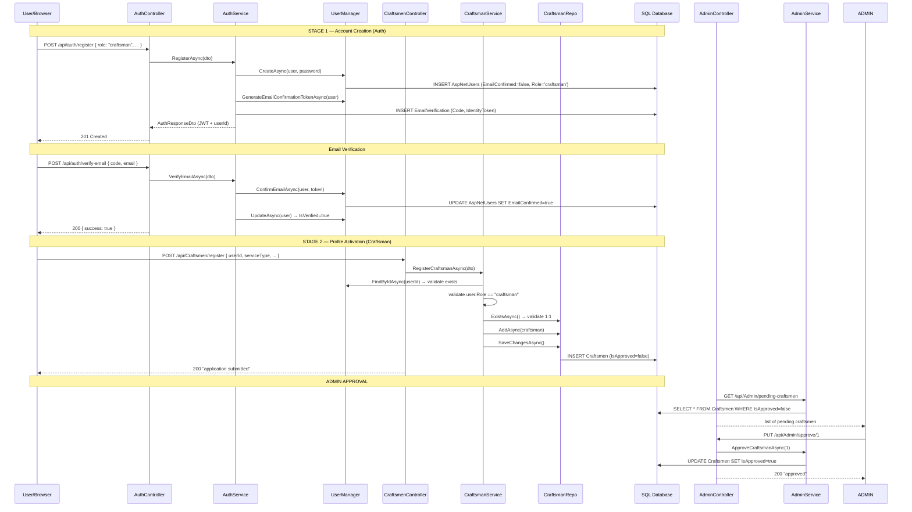
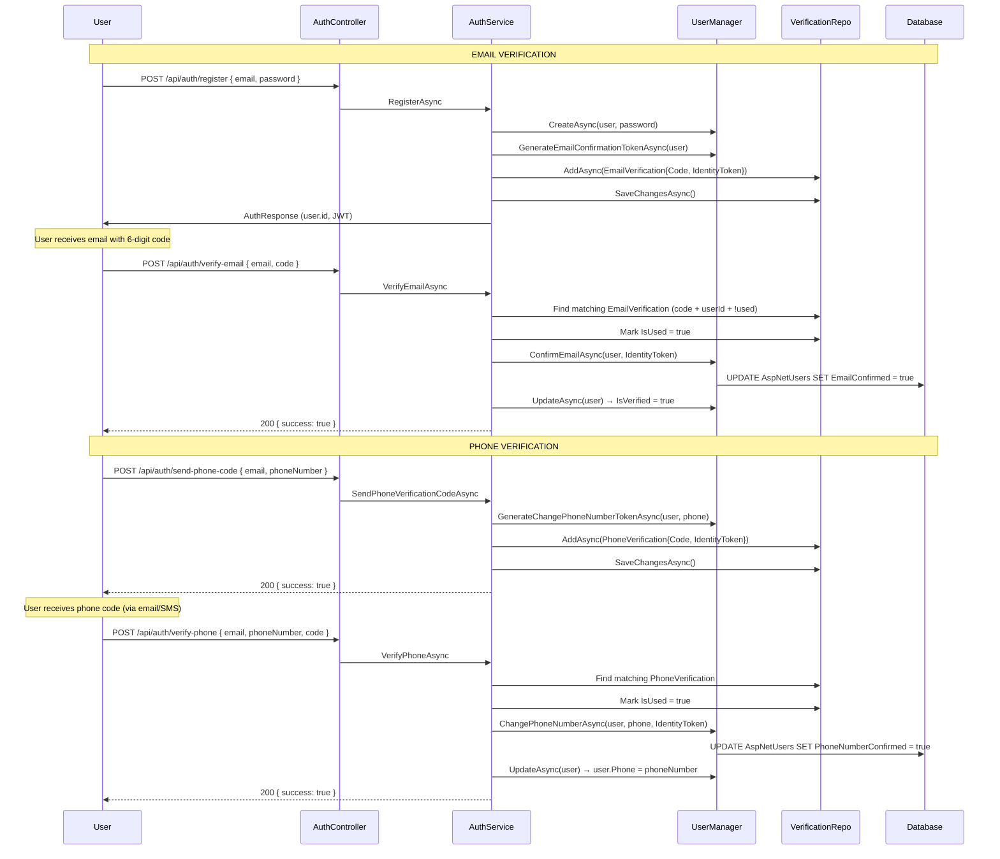

# Harfi Technical Architecture & End-to-End System Guide

> **Project:** Harfi — ربط العملاء المصريين بالحرفيين الموثقين  
> **Stack:** .NET 8 (N-Layered) + Angular (Frontend)  
> **Database:** SQL Server via Entity Framework Core  
> **Security:** ASP.NET Core Identity + JWT Bearer  
> **AI:** RAG (Qdrant vector DB, Voyage embeddings, Groq LLM)  
> **Real-time:** SignalR (Chat + Notifications)

---

## Table of Contents

1. [System Architecture Overview & Design Patterns](#1-system-architecture-overview--design-patterns)
2. [Global System Infrastructure](#2-global-system-infrastructure)
3. [Complete Solution Project Map](#3-complete-solution-project-map)
4. [Entity-Relationship Model](#4-entity-relationship-model)
5. [End-to-End Module & Endpoint Directory](#5-end-to-end-module--endpoint-directory)
   - 5.1 — Auth Module
   - 5.2 — Craftsman Module
   - 5.3 — User Module
   - 5.4 — Admin Module
   - 5.5 — Job Module
   - 5.6 — Review Module
   - 5.7 — Chat & Conversations Module
   - 5.8 — Notifications Module
   - 5.9 — AI / RAG Module
6. [Detailed Core Data Flows](#6-detailed-core-data-flows)
7. [Security Model & Authorization Matrix](#7-security-model--authorization-matrix)
8. [AI Pipeline Architecture](#8-ai-pipeline-architecture)
9. [Real-Time Communication (SignalR)](#9-real-time-communication-signalr)
10. [Frontend Integration Checklist](#10-frontend-integration-checklist)

---

## 1. System Architecture Overview & Design Patterns

### 1.1 N-Layered (N-Tier) Structure

```
┌──────────────────────────────────────────────────────────────────────────┐
│                        PRESENTATION LAYER                                │
│  Harfi.API (Controllers, Middleware, Hubs, Extensions)                   │
│  ┌─────────────┐  ┌─────────────┐  ┌─────────────┐  ┌───────────────┐   │
│  │ Controllers  │  │ Middleware  │  │ SignalR     │  │ Swagger/DI   │   │
│  │ (9 files)    │  │ (GlobalEx) │  │ Hubs (2)   │  │ Extensions   │   │
│  └──────┬──────┘  └─────────────┘  └─────────────┘  └───────────────┘   │
│         │ HTTP JSON                                                     │
├─────────┼────────────────────────────────────────────────────────────────┤
│         ▼                                                                │
│                        APPLICATION / SERVICE LAYER                       │
│  Harfi.Services (Interfaces + Implementations, 19 classes)              │
│  ┌──────────────────────────────────────────────────────────────┐       │
│  │  AuthService  │  UserService  │  CraftsmanService            │       │
│  │  JobService   │  ReviewService│  JobFeedbackService          │       │
│  │  ConversationService        │  MessageService               │       │
│  │  NotificationService        │  EmailService                 │       │
│  │  AdminService │  SolutionService                             │       │
│  │  RAGService   │  IntentService│  VectorDbService            │       │
│  │  EmbeddingService           │  ChunkingService              │       │
│  │  GroqRotatingClient (Singleton)                              │       │
│  └──────────────────────────────────────────────────────────────┘       │
│         │ calls interfaces                                               │
├─────────┼────────────────────────────────────────────────────────────────┤
│         ▼                                                                │
│                        REPOSITORY / PERSISTENCE LAYER                    │
│  Harfi.Repositories (Interfaces + Implementations)                      │
│  ┌──────────────────────────────────────────────────────────────┐       │
│  │  GenericRepository<T>  (base for all entity repos)           │       │
│  │  CraftsmanRepository   │  JobRepository                     │       │
│  │  ConversationRepository│  MessageRepository                 │       │
│  │  NotificationRepository│  ReviewRepository                  │       │
│  │  JobFeedbackRepository                                       │       │
│  └──────────────┬───────────────────────────────────────────────┘       │
│                 │ EF Core DbContext                                      │
├─────────────────┼────────────────────────────────────────────────────────┤
│                 ▼                                                        │
│                        DATABASE LAYER                                    │
│  SQL Server via AppDbContext                                             │
│  ┌──────────────────────────────────────────────────────────────┐       │
│  │  16 DbSets: Users, Craftsmen, Jobs, Conversations,          │       │
│  │  Messages, Reviews, Notifications, RefreshTokens,           │       │
│  │  AIChatMessages, RAGDocuments, MediaFiles, JobFeedbacks,    │       │
│  │  UserConnections, EmailVerifications, PhoneVerifications    │       │
│  └──────────────────────────────────────────────────────────────┘       │
└──────────────────────────────────────────────────────────────────────────┘
```

### 1.2 Dependency Direction

```
Controllers ──→ Service Interfaces ←── Service Implementations
       │                                       │
       │                                       ▼
       │                            Repository Interfaces ←── Repository Impls
       │                                       │
       │                                       ▼
       │                                 AppDbContext (EF Core)
       │                                       │
       └───────────────────────────────────────┘
                     Both use DTOs (Harfi.DTOs) and Entities (Harfi.Models)
```

**Golden Rule:** Controllers never access Repositories directly. Services never access Controllers. DTOs flow upward (DB → API), Commands flow downward (API → DB).

### 1.3 ASP.NET Core Identity Integration

The system uses ASP.NET Core Identity for **authentication and security** while maintaining custom **business boundaries**:

```
┌──────────────────────────────────────────────────────────────────┐
│                    USER (IdentityUser<int>)                       │
│  ┌────────────────────────────────────────────────────────┐      │
│  │  IDENTITY-MANAGED FIELDS (Single Source of Truth)     │      │
│  │  ──────────────────────────────────────────────────    │      │
│  │  • PasswordHash  → UserManager.CreateAsync only       │      │
│  │  • Email / EmailConfirmed → UserManager.ConfirmEmail  │      │
│  │  • Phone / PhoneConfirmed  → UserManager.ChangePhone  │      │
│  │  • SecurityStamp / ConcurrencyStamp → Identity        │      │
│  └────────────────────────────────────────────────────────┘      │
│  ┌────────────────────────────────────────────────────────┐      │
│  │  APPLICATION-MANAGED FIELDS (Custom Business)          │      │
│  │  ──────────────────────────────────────────────────    │      │
│  │  • Role (string: "admin"|"craftsman"|"customer")      │      │
│  │  • Name, Phone (custom formatting)                     │      │
│  │  • IsActive (soft delete)                              │      │
│  │  • IsVerified (secondary email confirmation flag)      │      │
│  │  • ProfileImageUrl                                     │      │
│  └────────────────────────────────────────────────────────┘      │
└──────────────────────────────────────────────────────────────────┘
```

**Key principle:** Identity fields are never written directly via DbContext. All mutations go through `UserManager<T>` methods. Custom fields (`Name`, `Role`, `IsActive`, etc.) are managed by application services via `UserManager.UpdateAsync`.

---

## 2. Global System Infrastructure

### 2.1 Global Exception Middleware

**File:** `Harfi.API/Middleware/GlobalExceptionMiddleware.cs`

Registered as the **first middleware** in the pipeline, ensuring all exceptions are caught uniformly:

```
Program.cs pipeline order:
  1. UseMiddleware<GlobalExceptionMiddleware>()  ← catches everything below
  2. UseSwagger / UseSwaggerUI
  3. UseStaticFiles
  4. UseHttpsRedirection
  5. UseCors("HarfiCors")
  6. UseAuthentication
  7. UseAuthorization
  8. MapControllers
  9. MapHub<ChatHub>("/hubs/chat")
  10. MapHub<NotificationHub>("/hubs/notifications")
```

**Exception-to-HTTP Status Mapping:**

| Exception Type | HTTP Status | Use Case |
|---|---|---|
| `InvalidOperationException` | **400 Bad Request** | Validation failures, duplicate records |
| `UnauthorizedAccessException` | **401 Unauthorized** | Bad credentials, expired token |
| `KeyNotFoundException` | **404 Not Found** | Missing entity lookups |
| `ArgumentNullException` | **400 Bad Request** | Missing required parameters |
| `ArgumentException` | **400 Bad Request** | Invalid argument values |
| `NotImplementedException` | **501 Not Implemented** | Stub/placeholder endpoints |
| All others | **500 Internal Server Error** | Unanticipated failures |

**Response shape (always JSON, camelCase):**
```json
{
  "status": 400,
  "message": "البريد الإلكتروني مسجل مسبقاً. جرب تسجيل الدخول.",
  "timestamp": "2026-06-01T10:30:00Z"
}
```

### 2.2 Fault-Tolerant External Communication Pattern

External network calls (SMTP for email) are wrapped in try-catch blocks to prevent network failures from crashing business flows:

```csharp
// AuthService.cs:92-97 — email delivery failure is non-blocking
try
{
    await _emailService.SendVerificationCodeAsync(user.Email!, user.Name, code);
}
catch (Exception ex)
{
    _logger.LogWarning(ex,
        "Failed to send verification email to {Email}. Registration completed anyway.",
        user.Email);
}
```

**Impact:** The user's account is created, the verification token/code is persisted in the database, and the registration completes with HTTP 201. The user can later request a code resend. The registration is never rolled back due to an unreachable SMTP server.

---

## 3. Complete Solution Project Map

| Project | Role | Key Contents |
|---|---|---|
| **Harfi.Models** | Domain Entities (POCO) | 15 entity classes, all relationships, validation attributes |
| **Harfi.DTOs** | Data Transfer Objects | 48 types (request/response DTOs, enums, embedded classes) |
| **Harfi.Repositories** | Data Access | 1 generic + 7 custom interfaces, 8 implementations, AppDbContext |
| **Harfi.Services** | Business Logic | 12 service interfaces, 19 implementation classes |
| **Harfi.API** | Presentation | 9 controllers (39 endpoints), 2 middleware, 2 SignalR hubs, DI extensions |

### 3.1 Entity Summary (15 entities)

| # | Entity | Table | PK | Key Relationships |
|---|---|---|---|---|
| 1 | `User` | AspNetUsers | int (Identity PK) | 1:1→Craftsman, 1:N→Job(as Customer), 1:N→Notification/RefreshToken/etc. |
| 2 | `Craftsman` | Craftsmen | int | 1:1→User, 1:N→Job, 1:N→Review, 1:N→Conversation |
| 3 | `Job` | Jobs | int | 1:1→Review, 1:1→Conversation, N:1→User(Customer), N:1→Craftsman |
| 4 | `Conversation` | Conversations | int | 1:1→Job, 1:N→Message, N:1→User(Customer), N:1→Craftsman |
| 5 | `Message` | Messages | int | N:1→Conversation, N:1→User(Sender) |
| 6 | `Review` | Reviews | int | 1:1→Job, N:1→User(Customer), N:1→Craftsman |
| 7 | `Notification` | Notifications | int | N:1→User, N:1→Job(optional) |
| 8 | `RefreshToken` | RefreshTokens | int | N:1→User |
| 9 | `AIChatMessage` | AIChatMessages | int | N:1→User, indexed by SessionId |
| 10 | `RAGDocument` | RAGDocuments | int | N:1→Job |
| 11 | `MediaFile` | MediaFiles | int | N:1→User(Uploader), polymorphic EntityType |
| 12 | `JobFeedback` | JobFeedbacks | int | N:1→User, N:1→RAGDocument |
| 13 | `UserConnection` | UserConnections | int | N:1→User (SignalR tracking) |
| 14 | `EmailVerification` | EmailVerifications | int | N:1→User, stores OTP + Identity token |
| 15 | `PhoneVerification` | PhoneVerifications | int | N:1→User, stores OTP + Identity token |

### 3.2 DbSet Registration (AppDbContext)

```csharp
DbSets: Users, Craftsmen, Jobs, Conversations, Messages,
        Reviews, Notifications, RefreshTokens, AIChatMessages,
        RAGDocuments, MediaFiles, JobFeedbacks, UserConnections,
        EmailVerifications, PhoneVerifications
```

---

## 4. Entity-Relationship Model

### 4.1 Core Domain Relationships

```
┌──────────────┐       ┌──────────────┐       ┌──────────────┐
│    User      │       │   Craftsman  │       │     Job      │
│──────────────│       │──────────────│       │──────────────│
│ Id (PK)      │──1:1──│ UserId (FK)  │       │ Id (PK)      │
│ UserName     │       │ Id (PK)      │       │ CustomerId   │──N:1──→ User
│ PasswordHash │       │ ServiceType  │       │ CraftsmanId  │──N:1──→ Craftsman
│ Email        │       │ City         │       │ Status       │
│ EmailConfirmed│      │ PriceRange   │       │ Description  │
│ Role         │       │ IsApproved   │       │ Address      │
│ Name         │       │ Rating       │       │ CreatedAt    │
│ Phone        │       │ Experience   │       │              │
│ IsActive     │       │ IsAvailable  │       │              │
│ IsVerified   │       │              │       │              │
└──────┬───────┘       └──────────────┘       └──────┬───────┘
       │                                              │
       │ 1:N                                          │ 1:1
       │                                              │
       ▼                                              ▼
┌──────────────┐       ┌──────────────┐       ┌──────────────┐
│ Notification │       │  Review      │       │ Conversation │
│──────────────│       │──────────────│       │──────────────│
│ UserId (FK)  │       │ JobId (FK)   │──1:1──│ JobId (FK)   │
│ Title        │       │ CustomerId   │       │ CustomerId   │──N:1→ User
│ Body         │       │ CraftsmanId  │       │ CraftsmanId  │──N:1→ Craftsman
│ IsRead       │       │ Stars (1-5)  │       │ LastMessageAt│
│ RelatedJobId─│─N:1   │ Comment      │       │              │
└──────────────┘       └──────────────┘       └──────┬───────┘
                                                      │ 1:N
                                                      ▼
                                              ┌──────────────┐
                                              │   Message    │
                                              │──────────────│
                                              │ ConversationId(FK)
                                              │ SenderId (FK)─→User
                                              │ Content (2000)
                                              │ MessageType (text|image|system)
                                              │ IsRead
                                              │ SentAt
                                              └──────────────┘
```

### 4.2 Verification Entities

```
┌─────────────────────┐    ┌─────────────────────┐
│  EmailVerification   │    │  PhoneVerification   │
│─────────────────────│    │─────────────────────│
│ Id (PK)             │    │ Id (PK)             │
│ UserId (FK) → User  │    │ UserId (FK) → User  │
│ Code (6-digit OTP)  │    │ PhoneNumber         │
│ IdentityToken       │    │ Code (6-digit OTP)  │
│ ExpiresAt           │    │ IdentityToken       │
│ IsUsed              │    │ ExpiresAt           │
│ CreatedAt           │    │ IsUsed              │
└─────────────────────┘    └─────────────────────┘
```

### 4.3 RAG & AI Relationships

```
┌──────────────┐       ┌──────────────┐       ┌──────────────┐
│    User      │       │  AIChatMsg   │       │  RAGDocument │
│──────────────│       │──────────────│       │──────────────│
│ Id (PK)      │──1:N──│ UserId (FK)  │       │ JobId (FK)   │──N:1→ Job
│              │       │ SessionId    │       │ ChromaDocId  │
│              │       │ Role (user|  │       │ ChunkType    │
│              │       │      assistant)│      │ (problem|    │
│              │       │ Content      │       │  solution)   │
│              │       │ ToolUsed     │       │              │
│              │       │ TokensUsed   │       │              │
└──────────────┘       └──────────────┘       └──────┬───────┘
                                                      │ 1:N
                                                      ▼
                                              ┌──────────────┐
                                              │ JobFeedback  │
                                              │──────────────│
                                              │ RAGDocumentId│
                                              │ UserId       │
                                              │ FeedbackType │
                                              │ (helpful|    │
                                              │  not_helpful)│
                                              └──────────────┘
```

---

## 5. End-to-End Module & Endpoint Directory

### 5.1 Auth Module

**Base Controller:** `AuthController.cs` → `api/auth`  
**Security:** Endpoints individually annotated (no class-level `[Authorize]`)

---

#### 5.1.1 POST `/api/auth/register` — Create Account

| Attribute | Value |
|---|---|
| **Security** | `[AllowAnonymous]` |
| **Rate Limit** | None (add if needed) |

**Backend Processing Sequence:**
1. `AuthController.Register` validates `ModelState`
2. `AuthService.RegisterAsync`:
   a. `_userManager.FindByEmailAsync` — checks email uniqueness
   b. `new User { ... Role = dto.Role }` — creates domain entity
   c. `_userManager.CreateAsync(user, password)` — hashes password via PBKDF2, saves to `AspNetUsers`
   d. `_userManager.GenerateEmailConfirmationTokenAsync(user)` — generates Identity crypto token
   e. Generates 6-digit random code, saves `EmailVerification` record
   f. `_emailService.SendVerificationCodeAsync` — sends HTML email (wrapped in try-catch)
   g. Generates JWT + RefreshToken, returns `AuthResponseDto`

**Database Mutations:**
- `AspNetUsers` — INSERT (Id, UserName, Email, PasswordHash, Role, Name, etc.)
- `EmailVerifications` — INSERT (UserId, Code, IdentityToken, ExpiresAt)
- `RefreshTokens` — INSERT (Token, UserId, ExpiresAt)

**Frontend Request:**
```json
{
  "name": "أحمد علي",
  "email": "ahmed@example.com",
  "password": "P@ssw0rd",
  "confirmPassword": "P@ssw0rd",
  "role": "customer|craftsman",
  "phone": "+201234567890"
}
```

**Frontend Success Response (201 Created):**
```json
{
  "accessToken": "eyJhbGciOiJIUzI1NiIs...",
  "refreshToken": "3a1f8e2b...base64...",
  "expiresAt": "2026-06-01T11:30:00Z",
  "user": {
    "id": 1,
    "name": "أحمد علي",
    "email": "ahmed@example.com",
    "role": "customer",
    "phone": "+201234567890",
    "profileImageUrl": null
  }
}
```

**Frontend Integration Workflow:**
- Call this endpoint first. Store `accessToken` in `localStorage`/`sessionStorage`.
- Store `refreshToken` securely (not in localStorage in production — use httpOnly cookie via backend if possible).
- Redirect user to email verification page.

---

#### 5.1.2 POST `/api/auth/login` — Authenticate

| Attribute | Value |
|---|---|
| **Security** | `[AllowAnonymous]` |

**Backend Processing Sequence:**
1. `AuthService.LoginAsync`:
   a. `_userManager.FindByEmailAsync` — finds user by email
   b. `_userManager.CheckPasswordAsync` — verifies password hash
   c. Checks `IsActive` and `IsVerified` flags
   d. Generates JWT (with claims: NameIdentifier, Email, Name, Role)
   e. Generates and saves cryptographically random RefreshToken

**Database Mutations:**
- `RefreshTokens` — INSERT (new token, UserId, ExpiresAt)

**Frontend Request:**
```json
{
  "email": "ahmed@example.com",
  "password": "P@ssw0rd"
}
```

**Frontend Success Response (200 OK):**
```json
{
  "accessToken": "eyJhbGciOiJIUzI1NiIs...",
  "refreshToken": "3a1f8e2b...",
  "expiresAt": "2026-06-01T11:30:00Z",
  "user": { /* same shape as register */ }
}
```

---

#### 5.1.3 POST `/api/auth/refresh` — Renew Access Token

| Attribute | Value |
|---|---|
| **Security** | `[AllowAnonymous]` |

**Backend:**
- Searches `RefreshTokens` by token value
- Validates `IsActive` (not revoked, not expired)
- Revokes old token, issues new JWT + new RefreshToken pair

**Frontend Request:**
```json
{
  "refreshToken": "3a1f8e2b..."
}
```

**Frontend Success Response (200 OK):** Same shape as login

---

#### 5.1.4 POST `/api/auth/logout` — Invalidate Session

| Attribute | Value |
|---|---|
| **Security** | `[Authorize]` |

**Frontend Request:** Same as refresh (`{ "refreshToken": "..." }`)

**Response (200 OK):** `{ "message": "تم تسجيل الخروج بنجاح" }`

---

#### 5.1.5 GET `/api/auth/me` — Current User Info

| Attribute | Value |
|---|---|
| **Security** | `[Authorize]` |

**Backend:** Reads claims directly from JWT (no database call).

**Response (200 OK):**
```json
{
  "id": "1",
  "name": "أحمد علي",
  "email": "ahmed@example.com",
  "role": "customer"
}
```

---

#### 5.1.6 GET `/api/auth/admin-only` & `/api/auth/craftsman-only`

| Endpoint | Role Required | Purpose |
|---|---|---|
| `admin-only` | `admin` | Test/example endpoint |
| `craftsman-only` | `craftsman` | Test/example endpoint |

---

#### 5.1.7 POST `/api/auth/verify-email` — 6-Digit Code Verification

| Attribute | Value |
|---|---|
| **Security** | `[AllowAnonymous]` |

**Backend Processing Sequence:**
1. `AuthService.VerifyEmailAsync`:
   a. `_userManager.FindByEmailAsync` — find user
   b. Check `user.IsVerified` — skip if already verified
   c. Find valid `EmailVerification` record (matching UserId + Code + !IsUsed + !Expired)
   d. Mark code as used (`IsUsed = true`)
   e. `_userManager.ConfirmEmailAsync(user, identityToken)` — **flips `EmailConfirmed` in Identity**
   f. Set `user.IsVerified = true` — **flips application flag**
   g. `_userManager.UpdateAsync(user)` — saves application fields

**Frontend Request:**
```json
{
  "email": "ahmed@example.com",
  "code": "483729"
}
```

**Response (200 OK):**
```json
{
  "success": true,
  "message": "تم تأكيد البريد الإلكتروني بنجاح."
}
```

---

#### 5.1.8 POST `/api/auth/resend-code` — Resend Email OTP

| Attribute | Value |
|---|---|
| **Security** | `[AllowAnonymous]` |

**Backend:** Invalidates old unused codes for the user → generates new Identity token + new 6-digit code.

**Frontend Request:**
```json
{
  "email": "ahmed@example.com"
}
```

**Response (200 OK):** `{ "success": true, "message": "تم إعادة إرسال رمز التحقق." }`

---

#### 5.1.9 POST `/api/auth/send-phone-code` — Initiate Phone Verification

| Attribute | Value |
|---|---|
| **Security** | `[Authorize]` |

**Backend:**
1. Finds user by Email (from DTO)
2. `_userManager.GenerateChangePhoneNumberTokenAsync(user, phoneNumber)` — generates Identity phone token
3. Generates 6-digit code
4. Saves `PhoneVerification` record
5. Sends code via email (SMS not yet integrated — placeholder)

**Frontend Request:**
```json
{
  "email": "ahmed@example.com",
  "phoneNumber": "+201234567890"
}
```

**Response (200 OK):**
```json
{
  "success": true,
  "message": "تم إرسال رمز التحقق للهاتف."
}
```

---

#### 5.1.10 POST `/api/auth/verify-phone` — Confirm Phone Number

| Attribute | Value |
|---|---|
| **Security** | `[Authorize]` |

**Backend:**
1. Find valid `PhoneVerification` record
2. Mark code as used
3. `_userManager.ChangePhoneNumberAsync(user, phoneNumber, identityToken)` — **flips `PhoneNumberConfirmed` in Identity**
4. Sync `user.Phone` with verified number

**Frontend Request:**
```json
{
  "email": "ahmed@example.com",
  "phoneNumber": "+201234567890",
  "code": "583194"
}
```

**Response (200 OK):**
```json
{
  "success": true,
  "message": "تم تأكيد رقم الهاتف بنجاح."
}
```

---

#### 5.1.11 POST `/api/auth/resend-phone-code` — Resend Phone OTP

| Attribute | Value |
|---|---|
| **Security** | `[Authorize]` |

---

### 5.2 Craftsman Module

**Base Controller:** `CraftsmenController.cs` → `api/Craftsmen`  
**Security:** Class-level `[Authorize]`, with `[AllowAnonymous]` on register, profile GET, and search

---

#### 5.2.1 POST `/api/Craftsmen/register` — Create Craftsman Profile (Stage 2)

| Attribute | Value |
|---|---|
| **Security** | `[AllowAnonymous]` (overrides class-level `[Authorize]`) |

**Backend Processing Sequence (full trace in `CraftsmanService.RegisterCraftsmanAsync`):**
1. `_userManager.FindByIdAsync(userId)` — validates user exists in `AspNetUsers`
2. Guard: `if (user.Role != "craftsman")` — prevents role escalation
3. `_craftsmanRepository.ExistsAsync(c => c.UserId == userId)` — checks 1:1 uniqueness
4. Creates `new Craftsman { IsApproved = false, Rating = 0, ... }`
5. `_craftsmanRepository.AddAsync(craftsman)` — tracks in EF Core ChangeTracker
6. `_craftsmanRepository.SaveChangesAsync()` — executes `INSERT INTO Craftsmen`

**Database Mutations:**
- `Craftsmen` — INSERT (UserId, ServiceType, City, PriceRangeMin, PriceRangeMax, Experience, Bio, NationalIdUrl, IsApproved=false)

**Frontend Request:**
```json
{
  "userId": 1,
  "serviceType": "سباك",
  "city": "القاهرة",
  "neighborhood": "مدينة نصر",
  "priceRangeMin": 200.00,
  "priceRangeMax": 800.00,
  "experience": 5,
  "bio": "سباك محترف بخبرة 10 سنوات",
  "nationalIdUrl": "https://res.cloudinary.com/.../national_id.jpg"
}
```

**Frontend Success Response (200 OK):**
```
"Your application has been successfully submitted and is currently under review."
```

**Frontend Integration Workflow:**
- **Must call this AFTER** `POST /api/auth/register` with `role: "craftsman"`
- User must have their `userId` from the registration response (from `authResponse.user.id`)
- After successful registration, show "pending approval" screen
- Redirect to profile page only after admin approves

---

#### 5.2.2 GET `/api/Craftsmen/{id}` — Get Craftsman Profile

| Attribute | Value |
|---|---|
| **Security** | `[AllowAnonymous]` |

**Backend:**
1. `_craftsmanRepository.GetByIdAsync(id)` — fetch from `Craftsmen` table
2. `LoadReferenceAsync(craftsman, c => c.User)` — eager-loads `User` navigation property
3. Maps to `CraftsmanDto` with joined data (Name, Email, Phone from User table)

**Response (200 OK):**
```json
{
  "id": 1,
  "userId": 1,
  "fullName": "أحمد علي",
  "email": "ahmed@example.com",
  "phone": "+201234567890",
  "profileImageUrl": null,
  "serviceType": "سباك",
  "city": "القاهرة",
  "neighborhood": "مدينة نصر",
  "priceRangeMin": 200.00,
  "priceRangeMax": 800.00,
  "experience": 5,
  "isApproved": true,
  "isAvailable": true,
  "rating": 4.5,
  "bio": "سباك محترف بخبرة 10 سنوات",
  "nationalIdUrl": "https://...",
  "createdAt": "2026-06-01T10:00:00Z"
}
```

---

#### 5.2.3 GET `/api/Craftsmen/search` — Filtered Search

| Attribute | Value |
|---|---|
| **Security** | `[AllowAnonymous]` |

**Query Parameters (all optional):**
- `serviceType` — exact match on `Craftsman.ServiceType`
- `city` — case-insensitive match on `Craftsman.City`
- `minRating` — minimum `Craftsman.Rating` (decimal)
- `minExperience` — minimum `Craftsman.Experience` (int)

**Backend:**
- Query filters: `WHERE IsApproved = true AND [optional filters]`
- Sorting: `ORDER BY Rating DESC`

**Response (200 OK):** Array of `CraftsmanDto` (same shape as profile, always includes joined user data)

---

#### 5.2.4 PUT `/api/Craftsmen/{id}` — Update Craftsman Profile

| Attribute | Value |
|---|---|
| **Security** | `[Authorize]` (class-level) |

**Frontend Request:**
```json
{
  "serviceType": "كهربائي",
  "city": "الإسكندرية",
  "neighborhood": "محرم بك",
  "priceRangeMin": 300.00,
  "priceRangeMax": 1000.00,
  "experience": 6,
  "bio": "كهربائي معتمد"
}
```

---

### 5.3 User Module

**Base Controller:** `UsersController.cs` → `api/Users`  
**Security:** Class-level `[Authorize]`

---

#### 5.3.1 GET `/api/Users/profile/{id}` — Get User Profile

| Attribute | Value |
|---|---|
| **Security** | `[Authorize]` |

**Backend:** `UserService.GetUserProfileAsync` → `_userManager.FindByIdAsync` → maps to `UserProfileDto`

**Response (200 OK):**
```json
{
  "id": 1,
  "name": "أحمد علي",
  "email": "ahmed@example.com",
  "role": "customer",
  "phone": "+201234567890",
  "profileImageUrl": null,
  "isActive": true,
  "createdAt": "2026-06-01T10:00:00Z"
}
```

---

#### 5.3.2 PUT `/api/Users/profile/{id}` — Update User Profile

| Attribute | Value |
|---|---|
| **Security** | `[Authorize]` |

**Frontend Request:**
```json
{
  "name": "أحمد علي الجديد",
  "phone": "+201098765432",
  "profileImageUrl": "https://res.cloudinary.com/.../avatar.jpg"
}
```

**Response (200 OK):** `"The profile has been successfully updated."`

---

### 5.4 Admin Module

**Base Controller:** `AdminController.cs` → `api/Admin`  
**Security:** `[Authorize(Roles = "admin")]` — all endpoints restricted

---

#### 5.4.1 GET `/api/Admin/pending-craftsmen` — List Unapproved

**Backend:** `AdminService.GetPendingCraftsmenAsync` → `ICraftsmanRepository.GetAllWithUserAsync()` → filters `Where(c => !c.IsApproved)`

**Response (200 OK):** Array of minimal `CraftsmanDto` (includes `nationalIdUrl` for identity verification).

---

#### 5.4.2 PUT `/api/Admin/approve/{id}` — Approve a Craftsman

**Backend:** `AdminService.ApproveCraftsmanAsync` → sets `IsApproved = true` → `UpdateAsync`

**Response (200 OK):** `"The craftsman's application was approved and his account successfully activated."`

---

#### 5.4.3 DELETE `/api/Admin/reject/{id}` — Reject a Craftsman

**Backend:** `AdminService.RejectCraftsmanAsync` → hard-deletes the `Craftsman` record

**Response (200 OK):** `"The craftsman's request was rejected and deleted from the system."`

---

### 5.5 Job Module

**Base Controller:** `JobsController.cs` → `api/jobs`  
**Security:** Class-level `[Authorize]`

**Status Workflow:** `open` → `in-progress` → `done` | `rejected` | `cancelled`

---

#### 5.5.1 POST `/api/jobs` — Create Job (Customer Only)

| Attribute | Value |
|---|---|
| **Security** | `[Authorize(Roles = "customer")]` |

**Backend:** `JobService.CreateJobAsync` → creates `Job` with `Status = "open"`, `CustomerId` from JWT

**Frontend Request:**
```json
{
  "craftsmanId": 1,
  "serviceType": "سباك",
  "description": "تسريب في حنفية المطبخ",
  "address": "12 شارع النصر، مدينة نصر",
  "preferredDate": "2026-06-05T10:00:00Z",
  "problemImageUrl": "https://res.cloudinary.com/.../leak.jpg",
  "problemDescription": "المياه بتتسرب من تحت الحنفية"
}
```

**Response (201 Created):** `JobResponseDto`

---

#### 5.5.2 PUT `/api/jobs/{id}/accept` — Accept Job (Craftsman Only)

| Attribute | Value |
|---|---|
| **Security** | `[Authorize(Roles = "craftsman")]` |

**Backend:** Validates job is `open` → sets `Status = "in-progress"` → creates notification for customer

**Response (200 OK):** `JobResponseDto`

---

#### 5.5.3 PUT `/api/jobs/{id}/reject` — Reject Job (Craftsman Only)

| Attribute | Value |
|---|---|
| **Security** | `[Authorize(Roles = "craftsman")]` |

**Backend:** Validates job is `open` → sets `Status = "rejected"` → notifies customer

---

#### 5.5.4 PUT `/api/jobs/{id}/complete` — Complete Job (Craftsman Only)

| Attribute | Value |
|---|---|
| **Security** | `[Authorize(Roles = "craftsman")]` |

**Backend:** Validates job is `in-progress` → sets `Status = "done"`, stores `SolutionDescription`, sets `CompletedAt` → notifies customer to leave review

**Frontend Request:**
```json
{
  "solutionDescription": "تم تغيير الحنفية بالكامل وتركيب جديدة"
}
```

---

#### 5.5.5 GET `/api/jobs/customer/{id}` — Get Customer Jobs

| Attribute | Value |
|---|---|
| **Security** | `[Authorize]` |

**Response (200 OK):** Array of `JobResponseDto` (all jobs for a customer, ordered by `CreatedAt` desc)

---

#### 5.5.6 GET `/api/jobs/craftsman/{id}` — Get Craftsman Jobs

| Attribute | Value |
|---|---|
| **Security** | `[Authorize]` |

**Response (200 OK):** Array of `JobResponseDto` (all jobs for a craftsman)

---

### 5.6 Review Module

**Base Controller:** `ReviewsController.cs` → `api/reviews`  
**Security:** Class-level `[Authorize]`

---

#### 5.6.1 POST `/api/reviews` — Submit Review (Customer Only)

| Attribute | Value |
|---|---|
| **Security** | `[Authorize(Roles = "customer")]` |

**Backend Validations:**
- Job exists AND `Status == "done"`
- JWT `NameIdentifier` matches `Job.CustomerId`
- No duplicate review for this job
- Stars between 1 and 5
- Comment max 1000 characters

**Frontend Request:**
```json
{
  "jobId": 5,
  "stars": 4,
  "comment": "شغل ممتاز والتزم بالوقت"
}
```

**Response (200 OK):**
```json
{
  "message": "تم إرسال تقييمك بنجاح",
  "data": {
    "id": 1,
    "jobId": 5,
    "stars": 4,
    "comment": "شغل ممتاز والتزم بالوقت",
    "customerName": "أحمد علي",
    "createdAt": "2026-06-01T12:00:00Z"
  }
}
```

---

#### 5.6.2 GET `/api/reviews/craftsman/{craftsmanId}` — Public Reviews

| Attribute | Value |
|---|---|
| **Security** | `[AllowAnonymous]` (overrides class-level) |

**Response (200 OK):**
```json
{
  "craftsmanId": 1,
  "totalReviews": 12,
  "averageStars": 4.3,
  "reviews": [
    {
      "id": 1,
      "jobId": 5,
      "stars": 4,
      "comment": "شغل ممتاز",
      "customerName": "أحمد علي",
      "createdAt": "2026-06-01T12:00:00Z"
    }
  ]
}
```

---

#### 5.6.3 POST `/api/reviews/rag-feedback` — AI Guide Feedback

| Attribute | Value |
|---|---|
| **Security** | `[Authorize]` (any role) |

**Purpose:** User clicks "ساعدني" or "ما زلت بحاجة لحرفي" on AI self-fix steps.

**Frontend Request:**
```json
{
  "ragDocumentId": 7,
  "feedbackType": "helpful"
}
```
`feedbackType` values: `"helpful"` | `"need_craftsman"`

**Response (200 OK):** `{ "message": "تم تسجيل رأيك بنجاح" }`

---

### 5.7 Chat & Conversations Module

**Base Controller:** `ConversationsController.cs` → `api/Conversations`  
**Security:** Class-level `[Authorize]`

---

#### 5.7.1 POST `/api/Conversations` — Create or Get Conversation

| Attribute | Value |
|---|---|
| **Security** | `[Authorize]` |

**Backend:** Checks if conversation already exists by (JobId, CustomerId, CraftsmanId). Returns existing or creates new.

**Frontend Request:**
```json
{
  "jobId": 5,
  "craftsmanId": 1
}
```

**Response (200 OK):**
```json
{
  "id": 1,
  "jobId": 5,
  "otherUserId": 1,
  "otherUserName": "أحمد علي",
  "otherUserAvatar": "https://...",
  "lastMessage": "مرحباً، متى يمكنك الحضور؟",
  "lastMessageAt": "2026-06-01T12:30:00Z",
  "unreadCount": 2
}
```

---

#### 5.7.2 GET `/api/Conversations` — List User Conversations

| Attribute | Value |
|---|---|
| **Security** | `[Authorize]` |

**Response (200 OK):** Array of `ConversationDto`, ordered by `LastMessageAt` desc

---

#### 5.7.3 GET `/api/Conversations/{id}` — Get Conversation Detail

| Attribute | Value |
|---|---|
| **Security** | `[Authorize]` |

**Security check:** User must be participant (customer or the craftsman whose `UserId` matches `Conversation.Craftsman.UserId`).

---

#### 5.7.4 GET `/api/Conversations/{id}/messages` — Paginated Messages

| Attribute | Value |
|---|---|
| **Security** | `[Authorize]` |

**Query Parameters:** `page` (default 1), `pageSize` (default 20, max 100)

**Backend:** Fetches messages ordered by `SentAt` desc (most recent first), includes `Sender` data

**Response (200 OK):**
```json
[
  {
    "id": 10,
    "conversationId": 1,
    "senderId": 1,
    "senderName": "أحمد علي",
    "senderAvatar": null,
    "content": "مرحباً، متى يمكنك الحضور؟",
    "messageType": "text",
    "isRead": true,
    "sentAt": "2026-06-01T12:30:00Z"
  }
]
```

**Real-Time Alternative:** Use SignalR Hub `/hubs/chat` for live messaging.

---

#### 5.7.5 PUT `/api/Conversations/{id}/read` — Mark Conversation Read

| Attribute | Value |
|---|---|
| **Security** | `[Authorize]` |

**Response:** 204 No Content

---

### 5.8 Notifications Module

**Base Controller:** `NotificationsController.cs` → `api/Notifications`  
**Security:** Class-level `[Authorize] |            |

---

#### 5.8.1 GET `/api/Notifications` — Get All Notifications

**Backend:** `ORDER BY CreatedAt DESC`, filtered by `UserId` from JWT

**Response (200 OK):**
```json
[
  {
    "id": 1,
    "title": "تم قبول طلبك",
    "body": "قام الحرفي بقبول طلب الصيانة الخاص بك",
    "type": "job_accepted",
    "relatedJobId": 5,
    "isRead": false,
    "createdAt": "2026-06-01T12:00:00Z"
  }
]
```

---

#### 5.8.2 GET `/api/Notifications/unread-count`

**Response (200 OK):** `{ "unreadCount": 3 }`

---

#### 5.8.3 PUT `/api/Notifications/{id}/read` — Mark One as Read

**Response:** 204 No Content

---

#### 5.8.4 PUT `/api/Notifications/read-all` — Mark All as Read

**Response:** 204 No Content

**Real-Time Alternative:** SignalR Hub `/hubs/notifications` for push notifications.

---

### 5.9 AI / RAG Module

**Base Controller:** `AIController.cs` → `api/AI`  
**Security:** Class-level `[Authorize]`, with `[AllowAnonymous]` on welcome and chat3

---

#### 5.9.1 GET `/api/AI/welcome` — Welcome Message

| Attribute | Value |
|---|---|
| **Security** | `[AllowAnonymous]` |

**Response (200 OK):**
```json
{
  "message": "أهلاً بك! 👋\nأنا مساعدك الذكي للعثور على أفضل الحرفيين في مصر.\nأخبرني بمشكلتك وسأجد لك الحرفي المناسب فوراً! 🔧"
}
```

---

#### 5.9.2 POST `/api/AI/chat3` — Multi-Turn AI Chat

| Attribute | Value |
|---|---|
| **Security** | `[AllowAnonymous]` |

**Backend Processing Sequence (the 7-step pipeline):**
1. **Language check** — if non-Arabic, return error asking user to write in Arabic
2. **Multi-service check** — if message mentions 2+ trades with "و", ask user to focus on one
3. **Intent routing** — `WantSteps`? Go to solution pipeline (3a, 3b, 3c)
4. **LLM extraction** — `IntentService.ExtractAsync` uses Groq to parse service type + city + count from conversation history
5. **Intent question** — if service is known but intent not asked, show "What do you want?" with buttons
6. **RAG query** — if all 3 fields extracted (service + city + count), run RAG against Qdrant
7. **Clarification** — if missing fields, return question to ask the user

**Frontend Request (conversation state is maintained client-side and sent each request):**
```json
{
  "messages": [
    { "role": "user", "content": "عندي مشكلة في المطبخ" },
    { "role": "assistant", "content": "أخبرني أكثر عن مشكلتك" },
    { "role": "user", "content": "البلاعات مسدودة" }
  ],
  "extractedService": null,
  "extractedCity": null,
  "extractedCount": null,
  "failedServiceAttempts": 0,
  "failedCityAttempts": 0,
  "failedCountAttempts": 0,
  "intent": 0,
  "problemClarificationAttempts": 0,
  "followUpState": 0,
  "lastProblemDescription": null
}
```

**Frontend Success Response — RAG Result (when complete):**
```json
{
  "isComplete": true,
  "message": "تمام! وجدت لك أفضل 3 سباكين في القاهرة 🎉\n\n...",
  "showServicesList": false,
  "servicesList": [],
  "showCitiesList": false,
  "citiesList": [],
  "showIntentChoice": false,
  "solutionSteps": null,
  "showSolvedQuestion": false,
  "extractedService": "سباك",
  "extractedCity": "القاهرة",
  "extractedCount": 3,
  "problemClarificationAttempts": 0,
  "followUpState": 0,
  "lastProblemDescription": null,
  "result": {
    "answer": "إليك أفضل 3 سباكين في القاهرة...",
    "retrievedCraftsmen": [
      {
        "id": 1,
        "name": "أحمد علي",
        "serviceType": "سباك",
        "city": "القاهرة",
        "neighborhood": "مدينة نصر",
        "rating": 4.5,
        "experienceYears": 8,
        "priceRangeMin": 200.00,
        "priceRangeMax": 600.00,
        "relevantText": "...",
        "similarityScore": 0.89,
        "isNearby": true,
        "nearbyFromCity": null
      }
    ],
    "latencyMs": 1245.67
  },
  "latencyMs": 1245.67
}
```

---

#### 5.9.3 POST `/api/AI/ingest/craftsmen` — Build RAG Index

| Attribute | Value |
|---|---|
| **Security** | `[Authorize]` (class-level) |

**Backend:** Iterates all craftsmen, chunks each into text, embeds via Voyage API, upserts to Qdrant `harfi_craftsmen` collection.

---

#### 5.9.4 POST `/api/AI/ingest/jobs` — Index Job Solutions

| Attribute | Value |
|---|---|
| **Security** | `[Authorize]` (class-level) |

**Backend:** Iterates completed jobs with solutions, embeds and stores in Qdrant `job_solutions` collection.

---

#### 5.9.5 GET `/api/AI/vectors/count` — Vector Count

| Attribute | Value |
|---|---|
| **Security** | `[Authorize]` (class-level) |

**Response (200 OK):** `{ "totalVectors": 1250 }`

---

## 6. Detailed Core Data Flows

### 6.1 Dual-Layer Registration & Activation Flow

```
┌─────────────────────────────────────────────────────────────────────────────────┐
│                     TWO-STAGE CRAFTSMAN REGISTRATION                             │
│                                                                                  │
│  STAGE 1: Account Creation (Auth Service)                                       │
│  ─────────────────────────────────────────────────                              │
│  Frontend                          Backend                         Database     │
│  ────────                          ──────                         ────────     │
│  [Registration Form]                                                             │
│  POST /api/auth/register            │                                           │
│  {                                  │                                           │
│   role: "craftsman",               │                                           │
│   name: "أحمد",                     │                                           │
│   email: "ahmed@test.com",          │                                           │
│   password: "P@ssw0rd"              │                                           │
│  }                                  │                                           │
│       │                             │                                           │
│       ▼                             │                                           │
│  201 Created ↓                      │                                           │
│  { accessToken, refreshToken,       │                                           │
│    user: { id: 5, role: "craftsman" }                                          │
│       │                             │                                           │
│       ▼                             │                                           │
│  [Email Verification Page]          │                                           │
│  POST /api/auth/resend-code         │                                           │
│  (auto-called or button)            │                                           │
│       │                             │                                           │
│       ▼                             │                                           │
│  [User checks email, gets 6-digit code]                                        │
│       │                             │                                           │
│       ▼                             │                                           │
│  POST /api/auth/verify-email        │                                           │
│  { email: "...", code: "483729" }   │                                           │
│       │                             │                                           │
│       │        ┌────────────────────┴────────────────────────┐                 │
│       │        │ UserManager.ConfirmEmailAsync(user, token)  │                 │
│       │        │ User.IsVerified = true                     │                 │
│       │        │ userManager.UpdateAsync(user)              │                 │
│       │        └────────────────────┬────────────────────────┘                 │
│       │                             │                                          │
│       ▼                             ▼                    ┌────────────────┐    │
│  200 { success: true }              │                    │ AspNetUsers    │    │
│                                     │                    │ EmailConfirmed │    │
│  ─────────────────────────────      │                    │ = true         │    │
│  STAGE 2: Profile Activation        │                    │ IsVerified     │    │
│  ─────────────────────────────      │                    │ = true         │    │
│                                     │                    └────────────────┘    │
│  POST /api/Craftsmen/register       │                                          │
│  {                                  │                                          │
│   userId: 5,                        │                                          │
│   serviceType: "سباك",              │                                          │
│   city: "القاهرة",                  │                                          │
│   experience: 5,                    │                                          │
│   nationalIdUrl: "https://..."      │                                          │
│  }                                  │                                          │
│       │                             │                                          │
│       │        ┌────────────────────┴────────────────────────┐                 │
│       │        │ UserManager.FindByIdAsync(userId=5)         │                 │
│       │        │ → validate: user.Role == "craftsman"        │                 │
│       │        │ → validate: !craftsmanRepo.Exists(userId)   │                 │
│       │        │ → Craftsman { IsApproved = false, ... }     │                 │
│       │        │ → craftsmanRepo.AddAsync(craftsman)         │                 │
│       │        │ → craftsmanRepo.SaveChangesAsync()           │                 │
│       │        └────────────────────┬────────────────────────┘                 │
│       │                             │                                          │
│       ▼                             ▼                    ┌────────────────┐    │
│  200 "تم إرسال الطلب"               │                    │ Craftsmen      │    │
│  [Redirect to "pending"]            │                    │ UserId=5       │    │
│                                     │                    │ IsApproved     │    │
│  ─────────────────────────────      │                    │ = false        │    │
│  ADMIN APPROVAL                     │                    └────────────────┘    │
│  ─────────────────────────────      │                                          │
│  [Admin Dashboard]                  │                                          │
│  GET /api/Admin/pending-craftsmen   │                                          │
│  → sees list with NationalIdUrl     │                                          │
│       │                             │                                          │
│       ▼                             │                                          │
│  PUT /api/Admin/approve/1           │                                          │
│       │                             │                                          │
│       │        ┌────────────────────┴────────────────────────┐                 │
│       │        │ Craftsman.IsApproved = true                 │                 │
│       │        │ → now visible in search results             │                 │
│       │        └─────────────────────────────────────────────┘                 │
│       │                                                                        │
│       ▼                                                                        │
│  [Craftsman appears in search & can accept jobs]                               │
└─────────────────────────────────────────────────────────────────────────────────┘
```

**Mermaid Syntax (for diagram rendering):**


### 6.2 Two-Phase Identity Validation Flow

```
┌────────────────────────────────────────────────────────────────────────────┐
│                PHASE 1: EMAIL VERIFICATION                                  │
│                                                                             │
│  At Registration:                                                           │
│    Identity Token (crypto) ─┐                                               │
│                              ├─ saved to EmailVerifications.IdentityToken   │
│    6-digit Code (human)   ───┘                                              │
│                                                                             │
│  At Verification:                                                           │
│    User submits { email, code }                                             │
│    → find EmailVerification where Code == submitted AND !IsUsed AND !Expired│
│    → Mark IsUsed = true                                                     │
│    → UserManager.ConfirmEmailAsync(user, identityToken)                     │
│    → ASP.NET Core Identity validates token cryptography, flips EmailConfirmed│
│    → Set user.IsVerified = true (application flag)                          │
│                                                                             │
│  Why both?                                                                  │
│    • 6-digit code → user-friendly, can be typed manually                    │
│    • Identity token → ASP.NET Core Identity's own cryptographic validation  │
│    • Together: the code makes UX smooth; the token guarantees security      │
│                                                                             │
├────────────────────────────────────────────────────────────────────────────┤
│                PHASE 2: PHONE VERIFICATION                                  │
│                                                                             │
│  Initiation (authenticated):                                                │
│    User submits { email, phoneNumber }                                      │
│    → UserManager.GenerateChangePhoneNumberTokenAsync(user, phone)           │
│    → 6-digit code generated, saved to PhoneVerifications                    │
│    → Code sent via email (SMS placeholder)                                  │
│                                                                             │
│  Verification (authenticated):                                              │
│    User submits { email, phoneNumber, code }                                │
│    → find PhoneVerification where Code == submitted AND !IsUsed             │
│    → Mark IsUsed = true                                                     │
│    → UserManager.ChangePhoneNumberAsync(user, phoneNumber, token)           │
│    → ASP.NET Core Identity flips PhoneNumberConfirmed                       │
│    → Sync user.Phone = phoneNumber                                          │
│                                                                             │
│  Design Note:                                                               │
│    Phone endpoints require [Authorize] because the user must be logged in   │
│    to claim a phone number. This prevents anonymous phone enumeration.       │
│    Email endpoints are [AllowAnonymous] because verification happens right   │
│    after registration when the user doesn't yet have a JWT.                 │
└────────────────────────────────────────────────────────────────────────────┘
```

**Mermaid Syntax:**


---

## 7. Security Model & Authorization Matrix

### 7.1 Role-Based Access Control

| Role | Can Access |
|---|---|
| **`admin`** | AdminController (all), Auth/admin-only |
| **`craftsman`** | Auth/craftsman-only, Jobs: accept/reject/complete, their own profile |
| **`customer`** | Jobs: create, Reviews: submit |
| **Any authenticated** | Users profile, Conversations, Notifications, Craftsmen update, AI ingest |
| **Anonymous** | Auth register/login/refresh/verify-email, Craftsmen register/search/profile, AI welcome/chat3, Reviews GET |

### 7.2 Endpoint Security Summary

| Controller | Class Auth | Per-Endpoint Overrides |
|---|---|---|
| `AuthController` | None (individual) | Multiple `[AllowAnonymous]` and `[Authorize(Roles)]` |
| `CraftsmenController` | `[Authorize]` | register, getById, search → `[AllowAnonymous]` |
| `UsersController` | `[Authorize]` | None |
| `AdminController` | `[Authorize(Roles = "admin")]` | None |
| `JobsController` | `[Authorize]` | create → `[Roles("customer")]`, accept/reject/complete → `[Roles("craftsman")]` |
| `ReviewsController` | `[Authorize]` | submit → `[Roles("customer")]`, get → `[AllowAnonymous]` |
| `ConversationsController` | `[Authorize]` | None |
| `NotificationsController` | `[Authorize]` | None |
| `AIController` | `[Authorize]` | welcome, chat3 → `[AllowAnonymous]` |

### 7.3 JWT Token Structure

```json
// Decoded JWT Payload:
{
  "sub": "1",                       // ClaimTypes.NameIdentifier
  "email": "ahmed@example.com",     // ClaimTypes.Email
  "name": "أحمد علي",               // ClaimTypes.Name
  "role": "craftsman",             // ClaimTypes.Role
  "nbf": 1717200000,
  "exp": 1717203600,
  "iss": "HarpiAPI",
  "aud": "HarfiFrontend"
}
```

SignalR connections pass the JWT via query string: `/hubs/chat?access_token=eyJ...`

### 7.4 Refresh Token Rotation

- Each refresh token is a 64-byte cryptographically random value (base64-encoded)
- On refresh: old token is revoked (`IsRevoked = true`), new token pair is issued
- Expiry: 7 days (configurable via `JwtSettings.RefreshTokenExpirationDays`)

---

## 8. AI Pipeline Architecture

### 8.1 RAG Query Pipeline

```
User Message (Arabic)
       │
       ▼
┌─────────────────────────┐
│  1. Language Check      │ ← if non-Arabic → reject with message
└─────────────────────────┘
       │
       ▼
┌─────────────────────────┐
│  2. IntentService       │ ← Groq LLM extracts serviceType + city + count
│     .ExtractAsync()     │    from conversation history
└─────────────────────────┘
       │
       ├─ Missing fields? ──→ Ask clarifying question to user
       │
       ▼
┌─────────────────────────┐
│  3. RAGService.Query()  │
│                         │
│  a. Expand query        │ ← add synonyms + known service keywords
│  b. Embed via Voyage    │ ← text-embedding-3-small (1024-dim)
│  c. Search Qdrant       │ ← `harfi_craftsmen` collection
│     - Local city first  │ ← filter by city, then nearby cities
│     - TopK results      │
│  d. Score fusion        │ ← 70% vector similarity + 30% rating
│  e. Verify via LLM      │ ← Groq checks extracted service matches
│  f. Build context       │ ← concatenated craftsman summaries
│  g. Generate answer     │ ← Groq generates Arabic response
└─────────────────────────┘
       │
       ├── Qdrant fails? → fallback to SQL query (direct DB)
       │
       ▼
┌─────────────────────────┐
│  4. Return Chat3Response│ ← answer text + craftsman list
└─────────────────────────┘
```

### 8.2 Solution Steps Pipeline

```
User: "عاوز خطوات" (wants solution steps)
       │
       ▼
┌─────────────────────────────────┐
│  1. SolutionService             │
│     .GetSolutionStepsAsync()     │
│                                 │
│  a. Embed problem description   │ ← Voyage
│  b. Search Qdrant `job_solutions│ ← similar solved jobs
│  c. Boosted scoring (60% sim +  │
│      25% review + 10% rating + 5% recency)
│  d. Verify suitability via LLM  │ ← Groq checks match
│  e. Polish steps via LLM        │
│  f. Return steps                │
└─────────────────────────────────┘
       │
       ├─ No match? → Fallback to pure LLM generation
       │
       ▼
   Return List<string> of solution steps
```

### 8.3 External Service Dependencies

| Service | API Endpoint | Purpose | Timeout |
|---|---|---|---|
| **Voyage AI** | `api.voyageai.com` | Text embeddings (1024-dim) | 60s |
| **Groq** | `api.groq.com` | LLM inference (intent extraction, answer generation) | 60s |
| **Qdrant** | `localhost:6400` | Vector DB (craftsmen + job solutions) | 30s |
| **Qdrant API Key Rotation** | Multiple keys in config | Rate-limit handling via `GroqRotatingClient` | N/A |

---

## 9. Real-Time Communication (SignalR)

### 9.1 Hubs

| Hub | Route | Purpose |
|---|---|---|
| `ChatHub` | `/hubs/chat` | Real-time messaging between customers and craftsmen |
| `NotificationHub` | `/hubs/notifications` | Push notifications (job updates, new messages) |

### 9.2 Authentication for Hubs

JWT is passed via query string: `?access_token=eyJ...` (handled by `OnMessageReceived` event in `ServiceExtensions.cs:138-152`).

### 9.3 Frontend Connection Example

```typescript
// Angular — connecting to ChatHub
const hubConnection = new signalR.HubConnectionBuilder()
  .withUrl('https://localhost:5001/hubs/chat', {
    accessTokenFactory: () => localStorage.getItem('accessToken')
  })
  .withAutomaticReconnect()
  .build();

hubConnection.start();
hubConnection.on('ReceiveMessage', (message: MessageDto) => {
  // append message to conversation
});
```

---

## 10. Frontend Integration Checklist

### 10.1 Must-Read Integration Order

The frontend must call endpoints in this logical order for complete user flow:

```
[New User Journey]
  1. POST /api/auth/register           → get userId, accessToken, refreshToken
  2. POST /api/auth/verify-email       → confirm email
  3. POST /api/auth/me                 → verify current auth state
  4. POST /api/Craftsmen/register      → create profile (if role=craftsman)
  5. POST /api/auth/send-phone-code    → initiate phone verification
  6. POST /api/auth/verify-phone       → confirm phone number

[Logged-in User Actions]
  - GET /api/auth/me                   → get current user info from token
  - POST /api/auth/refresh             → when accessToken expires
  - POST /api/auth/logout              → on sign-out

[Craftsman Search (anonymous)]
  1. POST /api/AI/chat3                → conversational search (optional)
  2. GET /api/Craftsmen/search?serviceType=... → direct search
  3. GET /api/Craftsmen/{id}            → view full profile
  4. GET /api/reviews/craftsman/{id}   → view reviews & rating

[Job Flow]
  1. POST /api/jobs                    → customer creates job
  2. PUT /api/jobs/{id}/accept         → craftsman accepts
  3. PUT /api/jobs/{id}/complete       → craftsman completes
  4. POST /api/reviews                 → customer reviews

[Admin Flow]
  1. GET /api/Admin/pending-craftsmen  → list unapproved
  2. PUT /api/Admin/approve/{id}       → approve
  3. DELETE /api/Admin/reject/{id}     → reject
```

### 10.2 Token Management

```typescript
// Store tokens on login/register
localStorage.setItem('accessToken', response.accessToken);
localStorage.setItem('refreshToken', response.refreshToken);

// HTTP interceptor — attach token to every request
@Injectable()
export class AuthInterceptor implements HttpInterceptor {
  intercept(req: HttpRequest<any>, next: HttpHandler) {
    const token = localStorage.getItem('accessToken');
    if (token) {
      req = req.clone({
        setHeaders: { Bearer: token }
      });
    }
    return next.handle(req);
  }
}

// Refresh interceptor — on 401, try refresh, retry original request
@Injectable()
export class RefreshInterceptor implements HttpInterceptor {
  constructor(private authService: AuthService) {}

  intercept(req: HttpRequest<any>, next: HttpHandler): Observable<HttpEvent<any>> {
    return next.handle(req).pipe(
      catchError(error => {
        if (error.status === 401 && !req.url.includes('/auth/refresh')) {
          return this.authService.refreshToken().pipe(
            switchMap(() => {
              const newReq = req.clone({
                setHeaders: { Bearer: localStorage.getItem('accessToken') }
              });
              return next.handle(newReq);
            })
          );
        }
        return throwError(error);
      })
    );
  }
}
```

### 10.3 Error Handling Convention

Every API response that fails returns the standard `ErrorResponse` shape:
```json
{
  "status": 400,
  "message": "Arabic error message",
  "timestamp": "2026-06-01T10:30:00Z"
}
```

Angular global error handler should:
1. Check `error.status`
2. Display `error.message` in a user-friendly notification (in Arabic)
3. If `status === 401`, redirect to login page
4. If `status === 403`, show "ليس لديك صلاحية" (you don't have permission)

### 10.4 Response Wrapping Convention

| Controller | Success Wrapping |
|---|---|
| Auth endpoints | JSON object (e.g., `AuthResponseDto`, `{ success, message }`) |
| Craftsmen GET | `CraftsmanDto` directly or array |
| Admin | Array of `CraftsmanDto` for list, Arabic string for approve/reject |
| Jobs | `JobResponseDto` |
| Reviews | `{ message: "...", data: ReviewResponseDto }` or `CraftsmanReviewsResponseDto` |
| Conversations | `ConversationDto` |
| Notifications | `NotificationDto[]` |
| AI Chat | `Chat3Response` |

### 10.5 Angular Route Structure (Suggested)

```
/register           → RegistrationComponent (calls POST /api/auth/register)
/login              → LoginComponent (POST /api/auth/login)
/verify-email       → VerifyEmailComponent (POST /api/auth/verify-email)
/craftsmen/register → CraftsmanRegisterComponent (POST /api/Craftsmen/register)
/craftsmen/:id      → CraftsmanProfileComponent (GET /api/Craftsmen/:id)
/craftsmen/search   → CraftsmanSearchComponent (GET /api/Craftsmen/search)
/profile            → UserProfileComponent (GET/PUT /api/Users/profile/:id)
/admin/pending      → AdminPendingComponent (GET /api/Admin/pending-craftsmen)
/chat               → ChatListComponent (GET /api/Conversations)
/chat/:id           → ChatDetailComponent (GET /api/Conversations/:id/messages)
/jobs               → JobListComponent (GET /api/jobs/customer/:id or /craftsman/:id)
/notifications      → NotificationsComponent (GET /api/Notifications)
/ai                 → AIChatComponent (POST /api/AI/chat3, GET /api/AI/welcome)
```

---

## Appendix A: DI Registration Summary

| Lifetime | Pattern | Examples |
|---|---|---|
| **Singleton** | One instance for the app lifetime | `GroqRotatingClient` (shared across all AI calls) |
| **Scoped** | One instance per HTTP request | All services, all repositories, `AppDbContext` |
| **Transient** | New instance every injection | None (all services are scoped) |

---

## Appendix B: Configuration Requirements

```json
{
  "ConnectionStrings": {
    "DefaultConnection": "Server=.;Database=HarfiDB;Trusted_Connection=True;TrustServerCertificate=True"
  },
  "JwtSettings": {
    "SecretKey": "your-256-bit-secret-here",
    "Issuer": "HarpiAPI",
    "Audience": "HarfiFrontend",
    "AccessTokenExpirationMinutes": 60,
    "RefreshTokenExpirationDays": 7
  },
  "EmailSettings": {
    "Host": "smtp.gmail.com",
    "Port": 587,
    "SenderEmail": "noreply@harfi.com",
    "AppPassword": "your-gmail-app-password",
    "SenderName": "Harfi Platform"
  },
  "Voyage": {
    "ApiKey": "your-voyage-api-key"
  },
  "Groq": {
    "ApiKey": "your-groq-api-key",
    "ApiKeys": ["key1", "key2"]  // for rotation
  },
  "Qdrant": {
    "BaseUrl": "http://localhost:6400/"
  },
  "AllowedOrigins": ["http://localhost:4200"]
}
```

---

*Generated for ITI Graduation Project — Harfi Platform. June 2026.*
